```{r setup, include=FALSE}
knitr::opts_chunk$set(echo = FALSE, warning = FALSE, 
                      message = FALSE, fig.pos = "H",
                      out.width = "80%",
                      fig.align = "center",
                      cache = TRUE)
```

\newpage

# Acknowledgments {.unnumbered}

We would like to sincerely thank Prof. John Newell for his
guidance, encouragement and support throughout this project. His expertise and
passion for his field, combined with his consistent energy, welcoming nature
and humour made this experience both memorable and inspiring. We are also grateful
to the lead scientist involved in the BioMimics 3D trial for sharing their
time, experience and insight with us. Our meetings provided a valuable
opportunity to understand the journey of a clinical trial from a statistical
and practical perspective. Both experiences provided us with a glimpse into
the work we hope to contribute to in our future careers.

\newpage
\tableofcontents
\newpage
\listoffigures
\listoftables
\newpage

# Abbreviations and Acronyms {.unnumbered}

\begin{tabular}{ll}
SAP & Statistical Analysis Plan \\
TVR & Target Vessel Revascularisation \\
PAD & Peripheral Artery Disease \\
ESS & Effective Sample Size \\
\end{tabular}

\newpage

# Introduction

## Single Arm Non-inferiority Trials

Single Arm non-inferiority trials arise when an effective treatment or device already exists and a placebo-controlled comparison would be unethical, impractical or clinically uninformative [@schumi_through_2011; @cuzick_interpreting_2022; @oczkowski_clinicians_2014]. Rather than demonstrating superiority, the goal is to show that any loss of efficacy associated with the new intervention remains within a clinically acceptable limit [@schumi_through_2011; @cuzick_interpreting_2022; @oczkowski_clinicians_2014]. This limit, known as the non-inferiority margin, represents the largest reduction in efficacy considered tolerable in exchange for other benefits such as improved safety, simpler delivery, lower cost or better patient adherence [@schumi_through_2011; @cuzick_interpreting_2022; @tweed_exploring_2024].

The trial conclusion depends on both the observed treatment effect and the uncertainty surrounding it [@schumi_through_2011; @cuzick_interpreting_2022; @international_council_for_harmonisation_statistical_1998]. In practice, this uncertainty is assessed by comparing a confidence interval for the treatment effect against the pre-specified non-inferioirty margin [@schumi_through_2011; @cuzick_interpreting_2022; @piaggio_reporting_2012]. For favourable endpoints, where higher values indicate better performance, the lower confidence bound is the relevant measure, while for unfavourable endpoints the upper bound is used [@schumi_through_2011; @cuzick_interpreting_2022]. This one-sided structure distinguishes non-inferiority trials from superiority and equivalence designs, and places the choice of margin and confidence interval method at the centre of the trial's interpretation [@schumi_through_2011; @cuzick_interpreting_2022; @oczkowski_clinicians_2014; @piaggio_reporting_2012].

## Performance Goals in Medical Device Studies

Performance goal studies are similar to single-arm non-inferiority designs and are particularly common in medical device trials [@schumi_through_2011; @wang_leveraging_2021; @wang_single-arm_2024]. Rather than comparing the observed outcome against a non-inferiority margin derived from a comparator treatment, performance goal studies compare the observed outcome with a pre-specified benchmark derived from historical evidence and clinical judgement [@wang_leveraging_2021; @rocha-singh_performance_2007]. This benchmark defines the acceptable level of performance for the device under evaluation, representing either a minimum acceptable proportion for favourable (efficacy) endpoints or a maximum acceptable proportion for unfavourable (safety) endpoints. [@wang_leveraging_2021; @rocha-singh_performance_2007].

Preformance goal studies are useful when a randomised active-control trial is difficult to justify or conduct [@wang_leveraging_2021; @wang_single-arm_2024]. However, the absence of a concurrent comparator makes the choice of benchmark especially consequential [@wang_leveraging_2021; @cao_estimating_2025]. Historical studies may differ from the current trial in ways that affect the validity of the comparison, including differences in the target population, endpoint definitions, follow-up duration and broader clinical practice [@wang_leveraging_2021; @cao_estimating_2025]. These differences must be carefully considered when constructing and justifying a performance goal.

The direction of the performance goal depends on the nature of the endpoint [@wang_leveraging_2021; @rocha-singh_performance_2007]. For efficacy endpoints, where higher event proportions reflect better performance, the estimated proportion and its confidence interval must exceed a predefined minimum acceptable level [@wang_leveraging_2021; @rocha-singh_performance_2007]. For safety endpoints, where lower proportions are desirable, the estimated proportion and its confidence interval must remain below a predefined maximum acceptable level of harm [@wang_leveraging_2021; @rocha-singh_performance_2007]. In either case, a performance goal should not be treated as a simple numerical cut-off [@international_council_for_harmonisation_statistical_1998; @wang_leveraging_2021; @rocha-singh_performance_2007]. It represents a clinical and statistical threshold whose validity depends on the endpoint being measured, the quality and consistency of the historical evidence, and the level of uncertainty considered acceptable for regulatory decision-making [@wang_leveraging_2021; @wang_single-arm_2024; @cao_estimating_2025].

## Motivation for Study

Although non-inferiority and performance goal designs appear straightforward in principle, their conclusions can be sensitive to several methodological choices [@schumi_through_2011; @cuzick_interpreting_2022; @oczkowski_clinicians_2014]. Small variations in any of these decisions can alter the interpretation of the same clinical data and, consequently, the study conclusion [@schumi_through_2011; @cuzick_interpreting_2022].

This sensitivity is particularly consequential in medical device studies, where single-arm performance goal designs are common and the absence of a concurrent comparator means the benchmark carries much of the evidential weight [@wang_leveraging_2021; @wang_single-arm_2024; @noauthor_medical_2026]. If the benchmark is too lenient, a device may appear acceptable despite a clinically meaningful loss of performance. If it is too strict, a device that performs well may require an impractically large sample size or fail to meet the criterion regardless [@tweed_exploring_2024; @wang_leveraging_2021; @cao_estimating_2025]. In either case, the benchmark itself shapes the conclusion before a single patient is enrolled.

Previous reviews have raised concerns about how consistently these choices are reported. Piaggio et al. found that only around one-fifth of 332 non-inferiority and equivalence trials published between 1990 and 2000 provided a suitable rationale for the chosen margin [@piaggio_reporting_2012]. A later review of 232 drug trials found that while nearly all reports specified a margin, only 24% explained how it had been determined [@piaggio_reporting_2012]. Together these findings point to a recurring problem: margins and performance goals are often presented as settled values without making the reasoning behind them transparent [@cuzick_interpreting_2022; @piaggio_reporting_2012].

This study is motivated by that problem. Using the BioMimics 3D vascular stent trial as a case study, it examines how performance goal selection, confidence interval choice and the assumptions underlying the sample size calculation interact to influence the design requirements and conclusions in a single-arm medical device setting [@schumi_through_2011; @international_council_for_harmonisation_statistical_1998; @wang_leveraging_2021].

## Case Study: BioMimics 3D Vascular Stent

The BioMimics 3D vascular stent trial serves as the primary case study throughout this analysis. Rather than attempting to reproduce the original trial, the case study is used as a real-world medical device example to examine how statistical choices surrounding performance goals, confidence intervals and sample size assumptions influence the interpretation of device performance.

Clinical and regulatory context for the analysis was obtained through meetings with a lead scientist involved in the original trial. These discussions clarified how the device was intended to be evaluated in practice and highlighted that the statistical design could not be reduced to a purely numerical exercise — it had to reflect clinical judgement, regulatory expectations and practical feasibility alongside the available evidence.

## Study Aims

This study has five objectives:

1.  To derive evidence-based performance goals for a single-arm medical device study through meta-analysis of comparable historical device studies;
2.  To compare confidence interval methods for binary endpoints in terms of coverage probability and interval width;
3.  To evaluate how performance goal selection and confidence interval choice affect sample size requirements and non-inferiority conclusions;
4.  To develop an interactive Shiny application, PG-Power, to support sample size planning and confidence interval method selection in performance goal studies;
5.  To explore the potential role of Bayesian historical borrowing as a means of reducing the required sample size.

# Background and Statistical Framework

## Superiority, Equivalence and Non-Inferiority

Superiority, equivalence, and non-inferiority trials address distinct clinical questions and cannot be interpreted interchangeably [@lesaffre_superiority_2008; @chow_sample_2017]. Let $p_T$ denote the success probability in the investigational treatment group and $p_C$ denote the success probability in the comparator group. For a binary success endpoint, the treatment effect is defined as [@chow_sample_2017; @schulz_sample_2005]:

$$\theta = p_T - p_C$$

A superiority trial evaluates whether the investigational treatment performs better than the comparator. The null and alternative hypotheses are [@schumi_through_2011; @lesaffre_superiority_2008; @chow_sample_2017]:

$$H_0: \theta \leq 0 \qquad H_1: \theta > 0$$

Superiority is concluded when the lower confidence bound for $\theta$ lies above zero [@schumi_through_2011].

An equivalence trial asks whether the difference between treatments is small enough to be considered clinically unimportant in either direction. Denoting the equivalence margin as $\Delta_E$, the hypotheses are [@piaggio_reporting_2012; @lesaffre_superiority_2008; @chow_sample_2017]:

$$H_0: \theta \leq -\Delta_E \text{ or } \theta \geq \Delta_E \qquad H_1: -\Delta_E < \theta < \Delta_E$$

Equivalence is concluded when the confidence interval for $\theta$ lies entirely within the equivalence margins [@piaggio_reporting_2012; @lesaffre_superiority_2008; @chow_sample_2017]:

$$-\Delta_E < \text{CI}_{1-\alpha}(\theta) < \Delta_E$$

A non-inferiority trial is less restrictive, focusing only on differences in the unfavourable direction. Denoting the non-inferiority margin as $\Delta_{NI}$, the largest clinically acceptable loss of efficacy, the hypotheses are [@schumi_through_2011; @cuzick_interpreting_2022; @lesaffre_superiority_2008; @chow_sample_2017]:

$$H_0: \theta \leq -\Delta_E, \quad \theta \geq \Delta_E \qquad H_1: -\Delta_E < \theta < \Delta_E$$

Non-inferiority is concluded when the lower confidence bound lies above the margin [@schumi_through_2011; @piaggio_reporting_2012; @lesaffre_superiority_2008; @chow_sample_2017]:

$$L_{1-\alpha}(\theta) > -\Delta_{NI}$$

These three designs are often confused in practice, but the distinction matters. Failure to demonstrate superiority does not imply equivalence or non-inferiority — a non-significant superiority test may simply reflect insufficient power or imprecision rather than genuine similarity between treatments [@schumi_through_2011; @cuzick_interpreting_2022; @lesaffre_superiority_2008]. Each design therefore requires its own pre-specified margin, endpoints, analysis population and decision rule, and conclusions should not be switched between frameworks after the data have been collected [@international_council_for_harmonisation_statistical_1998; @piaggio_reporting_2012; @chow_sample_2017].

```{r trial-designs, echo=FALSE, fig.cap="Confidence interval decision rules for superiority, non-inferiority and equivalence trials. Each row shows a representative 95% confidence interval for the treatment difference. The shaded region indicates the null hypothesis zone for each design.", out.width="100%"}

library(ggplot2)

col_sup  <- "#7F77DD"
col_ni   <- "#1D9E75"
col_eq   <- "#D85A30"
col_axis <- "#888780"
col_line <- "#2C2C2A"

# CI data
cis <- data.frame(
  label = factor(c("Superiority", "Non-inferiority", "Equivalence"),
                 levels = c("Equivalence", "Non-inferiority", "Superiority")),
  lo    = c(0.05, -0.10, -0.13),
  hi    = c(0.37,  0.24,  0.14),
  mid   = c(0.21,  0.07,  0.005),
  y     = c(3, 2, 1),
  color = c(col_sup, col_ni, col_eq)
)

ggplot() +
  
  # shading: superiority H0 (left of 0)
  annotate("rect", xmin = -0.55, xmax = 0,
           ymin = 2.6, ymax = 3.4, fill = col_sup, alpha = 0.10) +
  
  # shading: non-inferiority H0 (left of -delta)
  annotate("rect", xmin = -0.55, xmax = -0.20,
           ymin = 1.6, ymax = 2.4, fill = col_ni, alpha = 0.10) +
  
  # shading: equivalence H0 (both tails)
  annotate("rect", xmin = -0.55, xmax = -0.20,
           ymin = 0.6, ymax = 1.4, fill = col_eq, alpha = 0.10) +
  annotate("rect", xmin = 0.20, xmax = 0.55,
           ymin = 0.6, ymax = 1.4, fill = col_eq, alpha = 0.10) +
  
  # zero line
  geom_vline(xintercept = 0, colour = col_line,
             linewidth = 0.5, alpha = 0.45, linetype = "solid") +
  
  # NI margin
  geom_segment(aes(x = -0.20, xend = -0.20, y = 1.6, yend = 2.4),
               colour = col_ni, linewidth = 0.7, linetype = "dashed", alpha = 0.8) +
  
  # Equivalence margins
  geom_segment(aes(x = -0.20, xend = -0.20, y = 0.6, yend = 1.4),
               colour = col_eq, linewidth = 0.7, linetype = "dashed", alpha = 0.8) +
  geom_segment(aes(x =  0.20, xend =  0.20, y = 0.6, yend = 1.4),
               colour = col_eq, linewidth = 0.7, linetype = "dashed", alpha = 0.8) +
  
  # CI bars
  geom_segment(data = cis,
               aes(x = lo, xend = hi, y = y, yend = y, colour = label),
               linewidth = 1.6, lineend = "round", show.legend = FALSE) +
  geom_segment(data = cis,
               aes(x = lo, xend = lo, y = y - 0.09, yend = y + 0.09, colour = label),
               linewidth = 1.1, show.legend = FALSE) +
  geom_segment(data = cis,
               aes(x = hi, xend = hi, y = y - 0.09, yend = y + 0.09, colour = label),
               linewidth = 1.1, show.legend = FALSE) +
  geom_point(data = cis,
             aes(x = mid, y = y, colour = label),
             size = 2.8, shape = 16, show.legend = FALSE) +
  
  # row labels (right side)
  geom_text(data = cis,
            aes(x = 0.57, y = y, label = label, colour = label),
            hjust = 0, size = 3.8, fontface = "bold", show.legend = FALSE) +
  
  # axis zero label
  annotate("text", x = 0, y = 0.45, label = "0",
           size = 3, colour = col_axis, hjust = 0.5) +
  
  # margin labels
annotate("text", x = -0.20, y = 0.45, label = expression(-Delta),
         size = 3, colour = col_axis, hjust = 0.5) +
annotate("text", x =  0.20, y = 0.45, label = expression(+Delta),
         size = 3, colour = col_axis, hjust = 0.5) +
  
  scale_colour_manual(values = c(
    "Superiority"     = col_sup,
    "Non-inferiority" = col_ni,
    "Equivalence"     = col_eq
  )) +
  
  coord_cartesian(xlim = c(-0.55, 0.85), ylim = c(0.3, 3.6), clip = "off") +
  
  theme_minimal(base_size = 12) +
  theme(
    panel.grid       = element_blank(),
    axis.text        = element_blank(),
    axis.ticks       = element_blank(),
    axis.title       = element_blank(),
    axis.line.x      = element_line(colour = col_axis, linewidth = 0.5),
    plot.background  = element_rect(fill = "white", colour = NA),
    panel.background = element_rect(fill = "white", colour = NA),
    plot.margin      = margin(16, 100, 12, 20)
  )

ggsave("trial_designs.png", width = 8, height = 4.5, dpi = 200, bg = "white")


```

## Non-Inferiority Margins and Performance Goals

The non-inferiority margin is one of the central design choices in a non-inferiority trial [@schumi_through_2011; @cuzick_interpreting_2022; @us_food_and_drug_administration_non-inferiority_2016]. It defines the largest loss of efficacy considered clinically acceptable in exchange for other benefits offered by the investigational treatment [@schumi_through_2011; @tweed_exploring_2024; @us_food_and_drug_administration_non-inferiority_2016]. As established in Section 1.1, the selected margin affects the interpretation of the trial, the required sample size and the probability of concluding non-inferiority [@schumi_through_2011; @chow_sample_2017; @us_food_and_drug_administration_non-inferiority_2016].

In an active-control non-inferiority trial, the margin is usually defined relative to the established effect of the comparator. In single-arm medical device studies, the same logic is applied through a performance goal, a pre-specified benchmark against which the device is evaluated directly, without a concurrent control group [@wang_single-arm_2024; @wang_sample_2020]. For a binary efficacy endpoint, where higher proportions reflect better performance, the hypotheses take the form:

$$H_0: p \leq p_0 \qquad H_1: p > p_0$$

where $p$ is the true success probability for the investigational device and $p_0$ is the performance goal. Acceptable performance is concluded when the lower confidence bound exceeds the goal [@wang_leveraging_2021; @wang_single-arm_2024]:

$$L_{1-\alpha}(p) > p_0$$

For an unfavourable safety endpoint, where lower proportions reflect better performance, the direction is reversed:

$$H_0: p \geq p_0 \qquad H_1: p < p_0$$

and acceptable performance is concluded when the upper confidence bound falls below the goal [@schumi_through_2011; @oczkowski_clinicians_2014; @piaggio_reporting_2012]:

$$U_{1-\alpha}(p) < p_0$$

These rules highlight why the performance goal and confidence interval method are closely linked [@wang_leveraging_2021; @us_food_and_drug_administration_non-inferiority_2016]. The same observed event proportion can produce different confidence bounds depending on the method used, and when the bound lies close to the performance goal, that choice alone may determine whether the device is judged to meet the criterion [@wang_leveraging_2021; @brown_interval_2001]. This dependence motivates the comparison of confidence interval methods in Section 2.3 and the simulation study in Section 4.1 [@schumi_through_2011; @wang_leveraging_2021; @brown_interval_2001].

## Confidence Intervals for Proportions {#confidence-intervals-for-proportions}

In single-arm performance goal studies with binary endpoints, the primary analysis is based on an observed event proportion [@wang_leveraging_2021; @wang_single-arm_2024]. If $X$ patients experience the outcome of interest out of $n$ patients, the observed sample proportion is:

$$\hat{p} = \frac{X}{n}, \qquad X \sim \text{Binomial}(n, p)$$

where $p$ is the true underlying event probability. In this setting the confidence interval is not merely a descriptive summary — it forms part of the formal decision rule, and different methods applied to the same data can produce different conclusions, particularly at small sample sizes or extreme proportions [@brown_interval_2001; @agresti_categorical_2013].

Six methods are compared in this study. The **Wald interval** is the simplest, based on a normal approximation to the sampling distribution of $\hat{p}$ [@brown_interval_2001; @agresti_categorical_2013]:

$$\hat{p} \pm z_{1-\alpha/2} \sqrt{\frac{\hat{p}(1-\hat{p})}{n}}$$

It is included primarily as a reference, as it is known to perform poorly near the boundaries of 0 and 1 and can produce limits outside $[0, 1]$ [@brown_interval_2001].

The **Wilson Score interval** improves on the Wald interval by inverting the score test rather than approximating the sampling distribution directly [@brown_interval_2001]:

$$\frac{\hat{p} + \frac{z^2}{2n} \pm z\sqrt{\frac{\hat{p}(1-\hat{p})}{n} + \frac{z^2}{4n^2}}}{1 + \frac{z^2}{n}}$$

where $z = z_{1-\alpha/2}$. Unlike the Wald interval, it recentres the interval away from the observed proportion toward the centre of the parameter space, this stabilizes coverage probability near the boundaries of the $[0, 1]$ interval where the normal approximation breaks down [@brown_interval_2001].

The **Agresti-Coull interval** is closely related to the Wilson interval but constructs the interval around an adjusted proportion [@brown_interval_2001; @agresti_approximate_1998]:

$$\tilde{p} = \frac{X + \frac{z^2}{2}}{n + z^2}$$

$$\tilde{p} \pm z_{1-\alpha/2} \sqrt{\frac{\tilde{p}(1-\tilde{p})}{n + z^2}}$$

For a 95% interval this is approximately equivalent to adding two successes and two failures before applying the Wald formula, pulling extreme proportions away from the boundaries and improving stability [@brown_interval_2001; @agresti_approximate_1998].

The **Clopper-Pearson interval** is based directly on the binomial distribution rather than a normal approximation, with bounds obtained from beta distribution quantiles [@clopper_use_1934]:

$$L = B^{-1}\!\left(\frac{\alpha}{2};\, X,\, n-X+1\right), \qquad U = B^{-1}\!\left(1-\frac{\alpha}{2};\, X+1,\, n-X\right)$$

It is conservative by construction, meaning true coverage typically exceeds the nominal level [@noauthor_medical_2026; @brown_interval_2001]. This conservatism is consistent with FDA guidance on the use of exact methods in single-arm medical device studies, where the absence of a concurrent control makes protection of the Type I error rate especially important and conservative interval methods provide a natural safeguard against inflated false positive rates [@wang_leveraging_2021; @us_food_and_drug_administration_non-inferiority_2016; @health_cdrh_2026]. However, this conservatism comes at a practical cost: the wider intervals it produces increase sample size requirements relative to methods that sit closer to the nominal coverage level [@brown_interval_2001; @agresti_approximate_1998; @pires_interval_2008].

The **Wilson Score interval with continuity correction**, implemented in R via `prop.test()`, adjusts for the discreteness of the binomial distribution and is the default output of that function [@agresti_categorical_2013]. It is included because its widespread availability in standard R workflows means it is commonly used in practice, often without deliberate consideration of its properties [@brown_interval_2001].

The **Jeffreys interval** is Bayesian in construction, derived from the Jeffreys prior for a binomial proportion [@brown_interval_2001; @robert_harold_2009]:

$$p \sim \text{Beta}\!\left(\tfrac{1}{2}, \tfrac{1}{2}\right)$$

After observing $X$ events in $n$ patients, the posterior is:

$$p \mid X \sim \text{Beta}\!\left(X + \tfrac{1}{2},\, n - X + \tfrac{1}{2}\right)$$

The interval is obtained from the posterior quantiles. Despite its Bayesian construction, the Jeffreys interval is frequently evaluated using frequentist coverage properties and performs competitively in simulation studies of binomial intervals [@brown_interval_2001].

The key performance measure used to compare these methods is coverage probability — the probability that the constructed interval contains the true value of $p$ [@brown_interval_2001]:

$$\text{CP}(p) = P_p\!\left(L(X) \leq p \leq U(X)\right)$$

Because binomial outcomes are discrete, coverage fluctuates across values of $p$ and $n$ rather than sitting exactly at the nominal level [@brown_interval_2001]. This is particularly relevant in a performance goal setting, where a method that performs acceptably on average may still undercover at the specific proportion values most relevant to the clinical decision. The simulation study in Section 4.1 evaluates these methods on this basis before they are applied to the BioMimics 3D sample size calculations in Section 5.3.

## Sample Size in Non-Inferiority Studies

For a two-arm non-inferiority study with equal allocation and binary endpoints, an approximate sample size per group is given by [@chow_sample_2017; @julious_sample_2004]:

$$n = \frac{\left[z_{1-\alpha}\sqrt{2\bar{p}(1-\bar{p})} + z_{1-\beta}\sqrt{p_T(1-p_T) + p_C(1-p_C)}\right]^2}{(p_T - p_C + \Delta_{NI})^2}$$

where $n$ is the required number of patients per group, $\bar{p}$ is the average of the assumed success probabilities, $z_{1-\alpha}$ is the critical value for the one-sided type I error rate, and $z_{1-\beta}$ is the critical value corresponding to the desired power [@chow_sample_2017; @julious_sample_2004].

This formula highlights the importance of the distance between the expected treatment effect and the non-inferiority threshold [@schumi_through_2011; @chow_sample_2017]:

$$p_T - p_C + \Delta_{NI}$$

When this distance is large, the investigational treatment is expected to perform comfortably above the margin and a smaller sample size may be sufficient [@chow_sample_2017]. When it is small, more patients are needed to demonstrate non-inferiority with adequate power, and modest changes in the assumed proportions or margin can substantially affect the required $n$ [@tweed_exploring_2024; @chow_sample_2017].

In a single-arm performance goal study, the same principle applies but performance is compared against a fixed benchmark rather than an active control. The required sample size must provide a sufficiently high probability that the relevant confidence bound satisfies the performance goal, assuming the device performs at the expected true proportion $p_1$ [@wang_leveraging_2021; @wang_single-arm_2024]:

$$P_{p_1}\!\left(L_{1-\alpha}(X, n) > p_0\right) \geq 1 - \beta$$

where $L_{1-\alpha}(X, n)$ is the lower confidence bound calculated from $X$ successes in $n$ patients and $p_0$ is the performance goal. Since $X \sim \text{Binomial}(n, p)$, the power for a candidate sample size can be evaluated exactly by summing over all values of $X$ that satisfy the decision rule [@chow_sample_2017; @brown_interval_2001]:

$$\text{Power}(n) = \sum_{x=0}^{n} \mathbf{1}\!\left\{L_{1-\alpha}(x,n) > p_0\right\} \binom{n}{x} p_1^x (1-p_1)^{n-x}$$

where $\mathbf{1}\{\cdot\}$ is an indicator function equal to 1 when the confidence interval rule is satisfied and 0 otherwise. The required sample size is the smallest $n$ achieving the target power:

$$n^* = \min\left\{n : \text{Power}(n) \geq 1 - \beta\right\}$$

This formulation directly aligns the sample size calculation with the planned primary analysis [@wang_leveraging_2021; @us_food_and_drug_administration_non-inferiority_2016]. If the final decision will be based on a confidence interval method, the sample size calculation should use the same method — otherwise the design and analysis are operating under different statistical rules [@wang_leveraging_2021; @brown_interval_2001].

Power calculations for binomial endpoints follow a discrete, stepwise pattern because the decision criterion depends on an integer number of allowable events. As $n$ increases, the maximum allowable number of events remains fixed across certain ranges and increases only at specific thresholds [@brown_interval_2001]. Within each range, power decreases gradually as $n$ grows; it then jumps upward when an additional event becomes permissible. The result is a saw-tooth power curve that reflects the discrete nature of the binomial endpoint [@chow_sample_2017; @brown_interval_2001].

```{r sawtooth-power, echo=FALSE, fig.cap="Example saw-tooth power curve for a single-arm binary endpoint.", out.width="80%"}

N     <- 150:270
alpha <- 0.025
p0    <- 0.89
p1    <- 0.95

crit  <- qbinom(p = 1 - alpha, size = N, prob = p0)
power <- 1 - pbinom(q = crit, size = N, prob = p1)

par(
  mar    = c(4.5, 4.5, 1.5, 1.5),
  family = "sans",
  mgp    = c(2.8, 0.7, 0),
  tcl    = -0.3
)

plot(N, power,
     type = "l",
     lwd  = 1.8,
     col  = "#1D9E75",
     las  = 1,
     xlab = "Sample size (n)",
     ylab = "Power",
     ylim = c(0.65, 1.00),
     yaxt = "n",
     xaxt = "n",
     bty  = "l")

axis(2, at = seq(0.65, 1.00, by = 0.05),
     labels = sprintf("%.2f", seq(0.65, 1.00, by = 0.05)),
     las = 1, cex.axis = 0.85)

axis(1, at = seq(150, 270, by = 20),
     cex.axis = 0.85)

legend("bottomright",
       title     = "Example design",
       title.col = "#2C2C2A",
       legend    = c(
         expression(paste(p[0], " = 0.11  (performance goal)")),
         expression(paste(p[1], " = 0.05  (expected proportion)")),
         expression(paste(alpha,  " = 0.025  (one-sided)"))
       ),
       col      = "#888780",
       lty      = 0,
       pch      = NA,
       bty      = "n",
       cex      = 0.82,
       text.col = "#888780")
```

The required sample size can also be estimated through simulation. For each candidate $n$, a large number of trial datasets are generated under the assumed true proportion $p_1$, the selected confidence interval method is applied to each, and power is estimated as the proportion of simulated trials in which the decision rule is satisfied [@international_council_for_harmonisation_statistical_1998; @chow_sample_2017]. The required sample size is the smallest $n$ at which this simulated power meets the target [@wang_leveraging_2021; @brown_interval_2001; @chow_sample_2017]. This approach is implemented in specialist software including PASS [@noauthor_pass_nodate], nQuery [@elashoff_nquery_nodate] and Cytel East [@noauthor_east_nodate], as well as several R packages [@noauthor_binomconfint_nodate], and is particularly useful because it mirrors the planned analysis directly [@wang_leveraging_2021; @chow_sample_2017].

## Incorporating Prior Evidence: Bayesian Historical Borrowing

The frequentist sample size framework described in Section 4.2 treats each trial as an isolated exercise, making no formal use of evidence accumulated from comparable prior studies. Bayesian historical borrowing offers an alternative by incorporating this prior evidence directly into the analysis through a prior distribution, which is then updated with current trial data to produce a posterior distribution [@robert_harold_2009; @campbell_bayesian_2011; @ibrahim_power_2000]. In medical device studies, where single-arm designs are common and exchangeable historical data from comparable devices may be available, this approach can meaningfully reduce the required sample size [@wang_single-arm_2024; @cao_estimating_2025; @campbell_bayesian_2011].

For a binary endpoint, a natural and tractable model uses the Beta-Binomial conjugate structure [@agresti_categorical_2013; @robert_harold_2009; @us_food_and_drug_administration_guidance_2010]. If historical data contribute $\alpha_0$ observed events and $\beta_0$ observed non-events, the prior distribution is [@ibrahim_power_2000]:

$$p \sim \text{Beta}(\alpha_0, \beta_0)$$

After observing $s$ events and $f$ non-events in the current trial, the posterior distribution is obtained by conjugate updating [@robert_harold_2009; @ibrahim_power_2000; @us_food_and_drug_administration_guidance_2010]:

$$p \mid s, f \sim \text{Beta}(\alpha_0 + s,\; \beta_0 + f)$$

This posterior combines historical and current evidence into a single updated estimate of the true event probability. The influence of the prior relative to the current data is often summarised by its Effective Sample Size (ESS), which approximates the number of current observations the prior is equivalent to [@robert_harold_2009; @ibrahim_power_2000; @us_food_and_drug_administration_guidance_2010]. A prior with a large ESS concentrates the posterior more tightly around the historical estimate, potentially reducing the number of current patients needed to reach a given level of precision or power [@us_food_and_drug_administration_guidance_2010].

The central assumption underlying any borrowing strategy is exchangeability — the requirement that the historical and current populations are sufficiently similar that combining information across them is scientifically justified [@us_food_and_drug_administration_guidance_2010; @chiaruttini_bayesian_2025]. Where full exchangeability cannot be assumed, partial borrowing approaches allow the historical contribution to be downweighted [@ibrahim_power_2000; @chiaruttini_bayesian_2025]. The power prior of Ibrahim and Chen (2000) formalises this by raising the historical likelihood to a discounting factor $a_0 \in [0,1]$ before forming the prior, with $a_0 = 1$ representing full borrowing and $a_0 = 0$ representing no borrowing [@ibrahim_power_2000]. Adaptive borrowing methods take a data-driven approach, adjusting the degree of borrowing based on the observed compatibility between historical and current data — increasing borrowing when the two are consistent and reducing it when they diverge [@us_food_and_drug_administration_guidance_2010; @chiaruttini_bayesian_2025].

Because borrowing can affect operating characteristics including Type I error and power, its properties must be evaluated through simulation across a range of plausible scenarios before the design is finalised [@us_food_and_drug_administration_guidance_2010; @chiaruttini_bayesian_2025; @gamble_guidelines_2017]. Regulatory guidance on Bayesian statistics in medical device trials recognises the potential for historical borrowing to reduce sample size requirements while emphasising that the assumptions underlying the prior must be clinically and statistically justified [@campbell_bayesian_2011; @us_food_and_drug_administration_guidance_2010]. Section 4.4 applies this framework to the BioMimics 3D safety endpoint by incoperating the historical evidence derived in Section 5.1.

## Statistical Analysis Plans in Clinical Trials

A Statistical Analysis Plan (SAP) is a formal document that provides a detailed and technical description of the statistical methods to be used in the analysis of a clinical trial, elaborating on the approaches outlined in the study protocol [@gamble_guidelines_2017; @fradera_statistical_2024]. According to ICH E9, the SAP should be finalised before the unblinded review of data, ensuring that all analytical decisions are made independently of the observed results [@international_council_for_harmonisation_statistical_1998]. This requirement exists because statistical analysis involves choices about endpoints, methods, populations and decision rules that can influence the study's conclusions. Pre-specifying those choices reduces the risk of bias and of inflated Type I error while promoting transparency, reproducibility and scientific integrity.

Pre-specification is a cornerstone of reproducible clinical research and is expected by regulatory bodies, including the FDA and EMA, in submissions supporting a marketing authorisation [@international_council_for_harmonisation_statistical_1998; @noauthor_medical_2026; @kahan_how_2020]. In single-arm designs, where the absence of randomisation provides less protection against bias, a rigorously developed SAP is particularly important, and any deviations from it must be transparent and justified [@schulz_sample_2005; @gamble_guidelines_2017]. Without a concurrent control group, the conclusion relies on comparing the observed outcomes against a pre-specified benchmark. Consequently, key elements of this comparison — namely the performance goal value, confidence interval method and assumptions underlying the sample size calucaltion — can each independently alter the conclusion [@wang_leveraging_2021; @cao_estimating_2025; @kahan_how_2020].

The implications of these methodological choices for sample size requirements and study feasibility are examined thorugh the BioMimics 3D case study presented throughout this thesis.

# Case Study and Data Sources

## BioMimics 3D Vascular Stent

The BioMimics 3D vascular stent was selected as the primary case study throughout this analysis. The device is a self-expanding, permanent bare-metal nitinol stent developed for the treatment of femoropopliteal Peripheral Artery Disease (PAD), a condition characterised by atherosclerotic narrowing of the arteries supplying the lower limb [@rammos_biomimics_2024; @laird_nitinol_2010; @zeller_helical_2016]. In this setting, successful treatment is defined by achieving initial vessel patency and maintaining clinical benefit over time without restenosis, reintervention, amputation or major adverse events [@rocha-singh_performance_2007; @rammos_biomimics_2024; @tepe_local_2008].

Unlike conventional straight stents, the BioMimics 3D stent incorporates a helical geometry intended to mimic the natural curvature and movement of the femoropopliteal artery [@rammos_biomimics_2024; @zeller_helical_2016]. This design is hypothesised to promote blood flow patterns within the treated vessel and reduce the risk of restenosis after implantation [@rammos_biomimics_2024; @zeller_helical_2016]. Consequently, clinically meaningful outcomes such as Target Vessel Revascularisation (TVR), amputation and changes in Rutherford classification are important measures of the device's ability to provide sustained therapeutic benefit in patients with symptomatic PAD [@rocha-singh_performance_2007; @rammos_biomimics_2024; @laird_nitinol_2010].

Initial meetings with the lead scientist involved in the BioMimics development helped clarify the purpose of the device, the interpretation of clinically meaningful performance, and the practical and statistical constraints most relevant to the design of the pivotal study. This demonstrates the importance of clinical knowledge in informing the statistical design of the trial [@schumi_through_2011; @international_council_for_harmonisation_statistical_1998; @wang_leveraging_2021]. It is clinicians and scientists who determine key design assumptions such as the expected performance of BioMimics, sample size requirements, anticipated dropout rates, and other practical considerations that influence study design. Performance goals, endpoints and a sample size that are mathematically convenient but lack clinical relevance do not provide a robust basis for evaluating the device [@international_council_for_harmonisation_statistical_1998; @wang_leveraging_2021; @rocha-singh_performance_2007].

## Endpoints

Endpoint selection was guided by two criteria: clinical relevance to femoropopliteal disease and sufficient historical literature to support defensible performance goals [@wang_leveraging_2021; @rocha-singh_performance_2007]. Candidate endpoints were identified through a targeted review of comparable peripheral vascular device trials and the 2007 guidance document by Rocha-Singh et al. on behalf of VIVA Physicians, which synthesised evidence from three studies of femoropopliteal bare nitinol stents and served as the primary regulatory reference point for this analysis [@rocha-singh_performance_2007; @laird_nitinol_2010; @zeller_helical_2016].

For safety, candidate endpoints were assessed at 30 days and included all-cause mortality, major amputation and TVR. These were combined into a single composite endpoint because each component represents a clinically significant harm and individually the events occur too infrequently to yield stable estimates [@rocha-singh_performance_2007; @rammos_biomimics_2024; @laird_nitinol_2010].

For efficacy, candidate endpoints were assessed at 12 months. Rutherford classification, a clinical scale describing the severity of PAD symptoms, was selected because it captures patient-level disease status rather than purely anatomical outcomes [@rocha-singh_performance_2007; @laird_nitinol_2010]. Specifically, improvement or no deterioration in Rutherford score from post-intervention baseline was used, as this reflects whether patients experienced meaningful clinical benefit over the follow-up period [@rocha-singh_performance_2007; @rammos_biomimics_2024].

The selected endpoints were therefore the 30-day composite of all-cause mortality, major amputation and TVR for safety, and improvement or no deterioration in Rutherford classification score at 12 months for efficacy.

## Literature Search and Meta-analysis Data

The same guidance document was used to determine justifiable performance goal values for both the safety and efficacy endpoints.

For each relevant study, aggregate-level outcome data were extracted. This included the number of patients experiencing the endpoint and the number of patients assessed at the relevant follow-up time. Outcomes were grouped according to endpoint definition and time point before pooling. The time-point distinction was important because early safety outcomes at 30 days and longer-term efficacy outcomes at 12 months measure different aspects of device performance and cannot be combined into a single estimate [@rocha-singh_performance_2007; @rammos_biomimics_2024].

A logit transformation was used to stabilise the variance before pooling. This was required as the outcomes were binary proportions and because the extreme event proportions expected create boundary settings where raw proportions can behave poorly [@wang_leveraging_2021; @brown_interval_2001].

A generalised linear mixed model with a binomial likelihood was applied to pool study-level proportions. This approach was selected because the extracted data consisted of event counts versus study sample sizes and handled extreme proportions more appropriately than simple normal approximations. A random-effects structure was employed to allow for between-study heterogeneity rather than assuming that all studies estimated the same underlying event proportion. This was important because the historical studies differed in design, population, endpoint reporting and follow-up [@wang_leveraging_2021; @cao_estimating_2025].

The resulting estimates used to construct candidate performance goals were as follows. For the 30-day safety composite endpoint, the pooled estimate was approximately 6%, with the upper confidence limit extending to approximately 12%. Values between the pooled point estimate and the upper confidence limit were considered as the safety performance goal, giving a benchmark of approximately 6--12% for the maximum acceptable proportion of patients with an early composite event. For the 12-month stable or improved Rutherford classification endpoint, the pooled estimate was approximately 95.8%, with the lower confidence limit extending to approximately 88%. Values between the pooled point estimate and the lower confidence limit were considered as the efficacy performance goal, giving a benchmark of approximately 88--95.8% for the minimum acceptable proportion of patients with stable or improved Rutherford classification.

## Derivation of Performance Goals

In principle, the pooled point estimate from the historical studies represents the weighted average or best estimate of expected performance in the available evidence. However, using the point estimate directly as the performance goal would ignore uncertainty in the historical data [@wang_leveraging_2021]. This is problematic when the available evidence may be based on a small number of studies with limited sample sizes and differing endpoint definitions [@international_council_for_harmonisation_statistical_1998; @wang_leveraging_2021; @cao_estimating_2025].

For this reason, the proposed performance goals in this study were based on confidence interval boundaries rather than the pooled point estimates. For the safety endpoint, the upper confidence limit was proposed because higher event proportions represent worse performance. For the efficacy endpoint, the lower confidence limit was proposed because lower event proportions represent worse performance. This provided a conservative estimate incorporating the uncertainty in the historical event proportions [@wang_leveraging_2021; @rocha-singh_performance_2007].

\newpage

# Methods

## Simulation Study {#simulation-study}

To evaluate the confidence interval methods introduced in Section 2.3, a simulation study was designed following the approach of Pires & Amado (2008) @pires_interval_2008. The aim was to compare coverage probability and expected interval width across a range of true event proportions and sample sizes, before applying these methods within the performance goal framework [@pires_interval_2008].

For each scenario, the number of observed events was assumed to follow a binomial distribution,

$$X \sim \text{Binomial}(n, p)$$

where $X$ is the number of observed events, $n$ is the sample size and $p$ is the true underlying event probability [@brown_interval_2001]. Rather than evaluating performance at a single fixed proportion, a grid of true proportions was used to examine interval behaviour across a range of clinically plausible event proportions. Given that the BioMimics 3D endpoints involve either low complication or high success proportions, the simulation focused on the range [@brown_interval_2001; @pires_interval_2008]:

$$p \in \{0.001, 0.002, \ldots, 0.200\}$$

Methods were evaluated at three sample sizes, $n = 20$, 50 and 100, reflecting the small to moderate study sizes typical of single-arm performance goal studies [@wang_leveraging_2021; @wang_single-arm_2024].

For each combination of $n$, $p$ and confidence interval method, the confidence limits were calculated across all possible values of $X$. Two operating characteristics were then used to assess performance: coverage probability and expected interval width [@brown_interval_2001; @pires_interval_2008].

Coverage probability is the probability that the constructed interval contains the true value of $p$ [@brown_interval_2001]:

$$\text{CP}(p) = P_p\!\left(L(X,n) \leq p \leq U(X,n)\right)$$

where $L(X,n)$ and $U(X,n)$ are the lower and upper confidence limits. Since the target nominal level was 95%, a well-performing method should produce coverage close to 0.95 across the evaluated range. To summarise behaviour across the full grid, both the average coverage probability and the minimum coverage probability were recorded:

$$\overline{CP} = \frac{1}{m} \sum_{j=1}^{m} CP(p_j)$$

$$CP_{\min} = \min_{1 \leq j \leq m} CP(p_j)$$

The average captures typical performance, while the minimum identifies whether any method fell substantially below the nominal level at specific values of $p$.

Expected interval width was used as a measure of precision. For a given true proportion, sample size and method, the expected width was calculated as:

$$E_p[W(X,n)] = \sum_{x=0}^{n} \{U(x,n) - L(x,n)\} \binom{n}{x} p^x (1-p)^{n-x}$$

and averaged across the simulation grid to give an overall summary of interval length for each method [@brown_interval_2001; @pires_interval_2008]:

$$\bar{W} = \frac{1}{m} \sum_{j=1}^{m} E_{p_j}[W(X,n)]$$

Results were summarised graphically. Coverage probability was plotted against the true proportion $p$ for each method and sample size, with a dashed reference line at the nominal 95% level. Combined plots were also produced to allow direct comparison across methods on the same axes. A second set of plots compared average coverage probability against average expected interval width, providing a summary of the trade-off between reliability and precision for each method. The findings from this simulation informed the selection of confidence interval methods used in the sample size calculations in Section 4.2.

## Sample Size Calculation {#sample-size-calculation}

Sample size calculations were carried out for the BioMimics 3D case study using the single-arm performance goal framework described in Section 2.4 [@wang_leveraging_2021; @rocha-singh_performance_2007]. The endpoints, performance goal values, and assumed true event proportion were informed by the meta-analysis and clinical discussions described in Sections 3.1 and 3.3, with results reported in Section 5.3.

A target power of 90% was used throughout, which is conventional in medical device studies where 80% power, common in pharmaceutical trials, is considered insufficient to support a regulatory submission [@chow_sample_2017; @wang_sample_2020; @julious_sample_2004; @us_food_and_drug_administration_guidance_2010]. A one-sided significance level of $\alpha = 0.025$ corresponding to a one sided 97.5% confidence interval and consistent with the decision rule described in Section 2.2 was used[@oczkowski_clinicians_2014; @us_food_and_drug_administration_guidance_2010].

Sample size was determined through simulation rather than closed-form calculation, as exact analytical solutions are not always available when the confidence interval method forms part of the decision rule [@chow_sample_2017; @brown_interval_2001; @agresti_approximate_1998]. Simulation provides a flexible alternative that mirrors the planned primary analysis directly and is the approach implemented in PG-Power, described in Section 4.3.

## Shiny Application: PG-Power {#shiny-application-pg-power}

PG-Power is an interactive R Shiny application developed as part of this thesis to implement the simulation-based sample size framework described in Section 4.2 for single-arm performance goal studies. For each candidate sample size, the application simulates a large number of trials under the assumed true event proportion, applies the selected confidence interval method, and estimates power as the proportion of simulated trials satisfying the performance goal rule. The smallest $n$ achieving the target power is returned as the required sample size.

The application was used to carry out the BioMimics 3D sample size calculations and to compare the six confidence interval methods introduced in Section 2.3 under the same design assumptions, allowing the effect of interval choice on required sample size and achieved power to be examined consistently. Results are reported in Section 5.3. The full source code and documentation are available in the GitHub repository listed in the Appendix.

## Applying Bayesian Borrowing to the Safety Endpoint {#applying-bayesian-borrowing-to-the-safety-endpoint}

The frequentist sample size calculations in Section 4.2 made no use of the historical studies identified in Section 3.3 beyond their role in deriving the performance goal. This section examines whether formally incorporating that evidence as a prior distribution reduces the required sample size relative to the frequentist result obtained in Section 5.3 [@campbell_bayesian_2011; @us_food_and_drug_administration_guidance_2010].

To construct a concrete and interpretable prior, a hypothetical Phase II dataset of 50 participants with 2 observed events was used, producing a $\text{Beta}(2, 48)$ prior with an estimated event proportion of approximately 4% and an ESS of 50 [@us_food_and_drug_administration_guidance_2010]. The choice of a hypothetical dataset rather than the historical studies directly was deliberate. As the meta-analysis comprised of only three studies of limited sample sizes, a fully justified prior would be difficult to construct [@ibrahim_power_2000; @chiaruttini_bayesian_2025; @gamble_guidelines_2017]. The hypothetical prior therefore serves as an illustrative example of how borrowing would operate under plausible assumptions, rather than as a formal design recommendation [@campbell_bayesian_2011; @chiaruttini_bayesian_2025].

Under the Beta-Binomial model introduced in Section 2.5, incorporating $s$ events and $f$ non-events from the current trial updates the prior to [@robert_harold_2009; @us_food_and_drug_administration_guidance_2010]:

$$p \mid s, f \sim \text{Beta}(2 + s,\; 48 + f)$$

For inference, the posterior probability that the true event proportion falls below the performance goal was evaluated against a decision threshold of 0.95 [@campbell_bayesian_2011; @us_food_and_drug_administration_guidance_2010]:

$$P(p < p_0 \mid s, f) \geq 0.95$$

The required sample size was determined as the smallest $n$ for which this criterion was satisfied with at least 90% probability under the assumed true event proportion of 5%, consistent with the frequentist design assumptions in Section 4.2 [@chow_sample_2017; @us_food_and_drug_administration_guidance_2010].

To examine sensitivity to prior weight, three prior distributions were compared: $\text{Beta}(0.2, 4.8)$, $\text{Beta}(2, 48)$ and $\text{Beta}(20, 480)$, encoding the same event ratio of approximately 1:24 but corresponding to ESS of approximately 5, 50 and 500, representing weak, moderate and strong borrowing respectively [@ibrahim_power_2000; @chiaruttini_bayesian_2025; @gamble_guidelines_2017].

\newpage

# Results

## Meta-Analysis Results {#meta-analysis-results}

The meta-analysis of the three femoropopliteal bare nitinol stent studies described in Section 3.3 produced pooled estimates for both endpoints. The results are summarised in Figures 3 and 4.

```{r performance-goals-table, echo=FALSE, message=FALSE, warning=FALSE, out.width="80%"}
library(kableExtra)

pg_tbl <- data.frame(
  Endpoint           = c("Composite (Death, Amputation, TVR)", "RCC (Improved, No Change)"),
  Timepoint          = c("30 Days", "12 Months"),
  `Pooled Proportion` = c("6.0\\%", "95.8\\%"),
  `95\\% CI`         = c("[2.9, 12.1\\%]", "[87.9, 98.6\\%]"),
  `Performance Goal` = c("$\\leq$ 12\\%", "$\\geq$ 88\\%"),
  check.names = FALSE
)

kbl(pg_tbl, booktabs = TRUE, escape = FALSE, align = "lcccc", linesep = "",
    caption = "Performance Goals for Safety and Efficacy") |>
  kable_styling(latex_options = "HOLD_position", full_width = FALSE, font_size = 11) |>
  row_spec(0, background = "#3A3A6A", color = "white", bold = FALSE) |>
  column_spec(1, width = "5.2cm") |>
  pack_rows("Safety Endpoints",   1, 1, background = "#4A4A6A", color = "white", bold = FALSE) |>
  pack_rows("Efficacy Endpoints", 2, 2, background = "#6B4A2A", color = "white", bold = FALSE)
```

```{r forest-plot, echo=FALSE, fig.pos="H", fig.cap="Pooled event proportions with 95% confidence intervals for the safety and efficacy endpoints.", out.width="80%"}
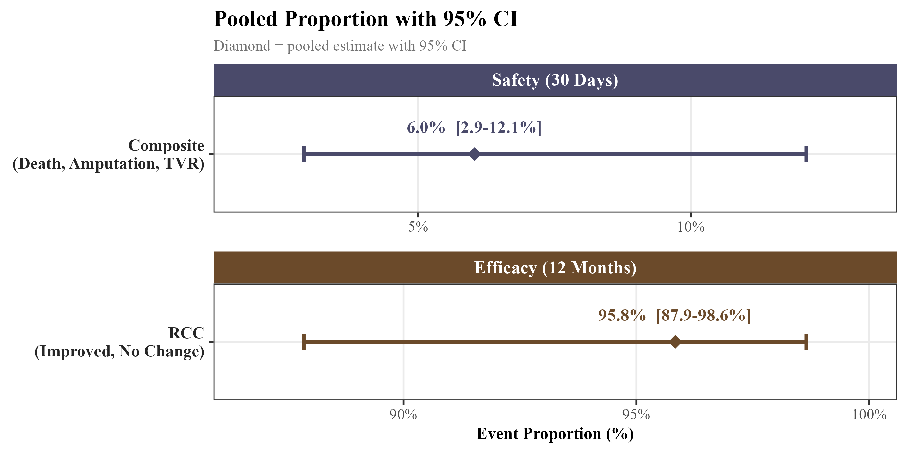
```

The heterogeneity statistics for both endpoints are reported in Tables 2 and 3.

```{r heterogeneity-A, echo=FALSE, message=FALSE, warning=FALSE, out.width="80%"}
library(kableExtra)
het_A <- data.frame(
  Measure         = c("$\\tau^2$", "$I^2$", "H", "Q (Wald)", "Q (LRT)"),
  Value           = c("0.00", "0.0\\%", "1.00", "0.00", "NA"),
  `CI or p-value` = c("NA", "0.0\\% to 0.9\\%", "1.00 to 3.10", "$p$ = 0.998", "NA"),
  check.names = FALSE
)
kbl(het_A, booktabs = TRUE, escape = FALSE, align = "lcc", linesep = "",
    caption = "Heterogeneity Statistics: 30-day Composite") |>
  kable_styling(latex_options = "HOLD_position", full_width = FALSE, font_size = 11) |>
  row_spec(0, background = "#3A3A6A", color = "white", bold = TRUE) |>
  column_spec(1, width = "3cm")
```

```{r heterogeneity-B, echo=FALSE, message=FALSE, warning=FALSE, out.width="80%"}
het_B <- data.frame(
  Measure         = c("$\\tau^2$", "$I^2$", "H", "Q (Wald)", "Q (LRT)"),
  Value           = c("0.00", "0.0\\%", "1.00", "1.31", "NA"),
  `CI or p-value` = c("NA", "0.0\\% to 0.9\\%", "1.00 to 3.10", "$p$ = 0.520", "NA"),
  check.names = FALSE
)
kbl(het_B, booktabs = TRUE, escape = FALSE, align = "lcc", linesep = "",
    caption = "Heterogeneity Statistics: 12-month Rutherford classification") |>
  kable_styling(latex_options = "HOLD_position", full_width = FALSE, font_size = 11) |>
  row_spec(0, background = "#3A3A6A", color = "white", bold = TRUE) |>
  column_spec(1, width = "3cm")
```

For both endpoints, the estimated between-study variance $\tau^2$ was 0 and the $I^2$ statistic was 0.0% (95% CI: 0.0--0.9%), with $H = 1.00$. Cochran's Q test produced $p$-values of 0.998 and 0.520 for the safety and efficacy endpoints respectively. The implications of these heterogeneity estimates for the interpretation of the derived performance goals are discussed in Section 6.1.

## Simulation Study: CI Method Comparison {#simulation-study-results}

Coverage probability was evaluated across a grid of true proportions $p \in \{0.001, \ldots, 0.200\}$ for each of the six confidence interval methods at sample sizes $n = 50$ and $n = 100$. Results are summarised through coverage probability curves and coverage-width scatter plots.

```{r coverage-prob-n50, echo=FALSE, fig.cap="Coverage probability curves for six binomial confidence interval methods at n = 50, evaluated across true proportions p in {0.001, ..., 0.200}. The dashed red line indicates the nominal 95% level.", out.width="100%"}
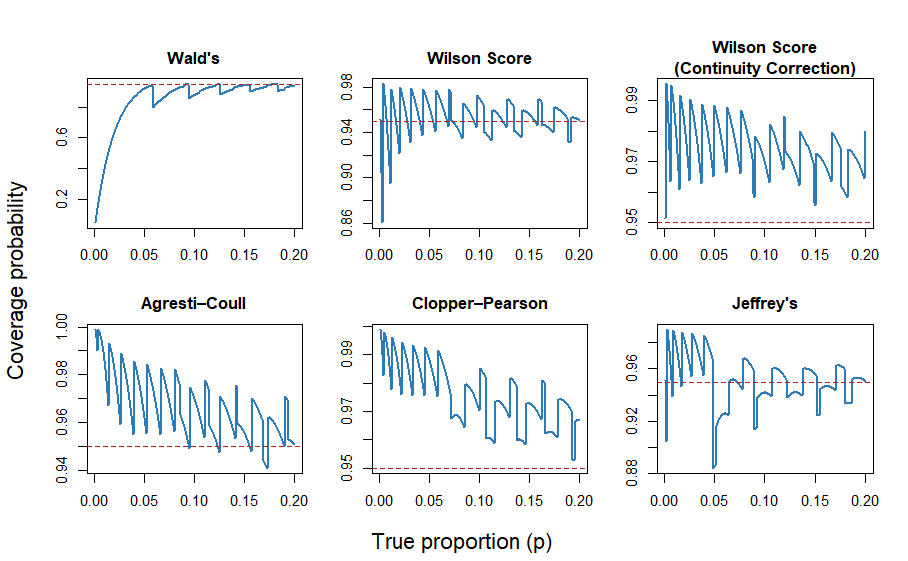
```

At $n = 50$, the Wald interval produced coverage below 0.80 for true proportions near zero, only approaching the nominal level near $p = 0.20$. The Wilson Score interval oscillated around 0.95, with dips below 0.90 at low proportions near $p = 0.001$ to 0.01. The Jeffreys interval followed a similar pattern but with more pronounced dips below nominal at low proportions. The Wilson Score with continuity correction and Agresti-Coull interval maintained coverage above the nominal level across virtually the entire proportion range. The Clopper-Pearson interval was the most conservative, with coverage remaining above 0.97 across nearly the entire evaluated range.

```{r coverage-prob-n100, echo=FALSE, fig.cap="Coverage probability curves for six binomial confidence interval methods at n = 100, evaluated across true proportions p in {0.001, ..., 0.200}. The dashed red line indicates the nominal 95% level.", out.width="100%"}
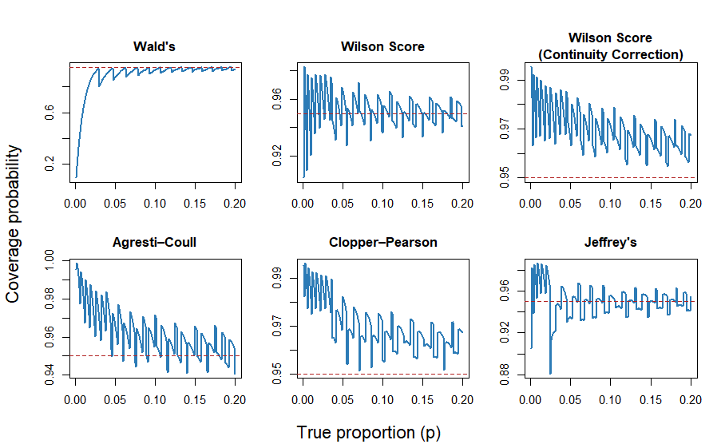
```

At $n = 100$ the pattern was broadly similar. The Wald interval remained well below 0.95 across most of the proportion range. The remaining five methods continued to oscillate above the nominal level, with Wilson Score and Jeffreys tracking closest to 0.95 and Clopper-Pearson, Agresti-Coull and Wilson Score with continuity correction remaining the most conservative.

```{r coverage-prob-overlay, echo=FALSE, fig.cap="Coverage probability curves for all six methods overlaid at n = 100. The dashed red line indicates the nominal 95% level.", out.width="100%"}
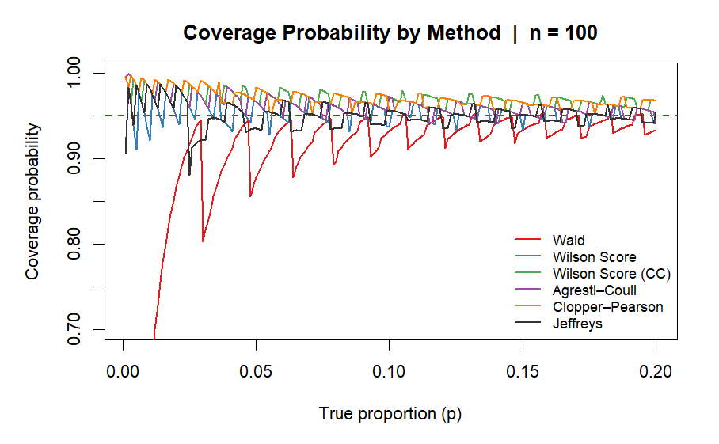
```

The combined overlay for $n = 100$ shows all six methods on the same axes, illustrating the clear separation between the Wald interval and the remaining five methods across the full proportion range.

The coverage-width scatter plots summarise the trade-off between average coverage probability and average expected interval width at each sample size.

```{r coverage-width-n20, echo=FALSE, fig.cap="Average coverage probability against average expected interval width at n = 20.", out.width="80%"}
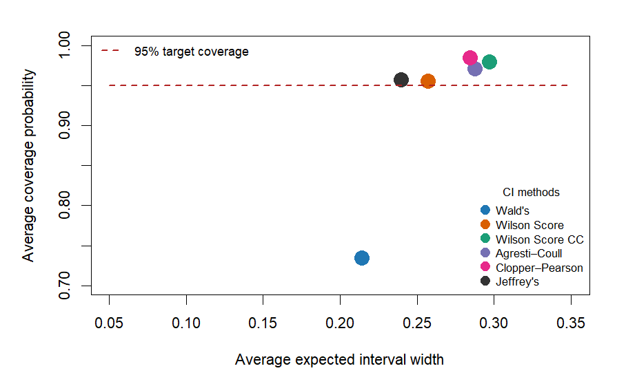
```

At $n = 20$, the Wald interval produced average coverage of approximately 0.73 with an average width of approximately 0.21. Wilson Score and Jeffreys sat at or just above the nominal line with average widths of approximately 0.24 and 0.25 respectively. Clopper-Pearson, Agresti-Coull and Wilson Score with continuity correction sat above the nominal line with average widths of approximately 0.29 and 0.30.

```{r coverage-width-n50, echo=FALSE, fig.cap="Average coverage probability against average expected interval width at n = 50.", out.width="80%"}
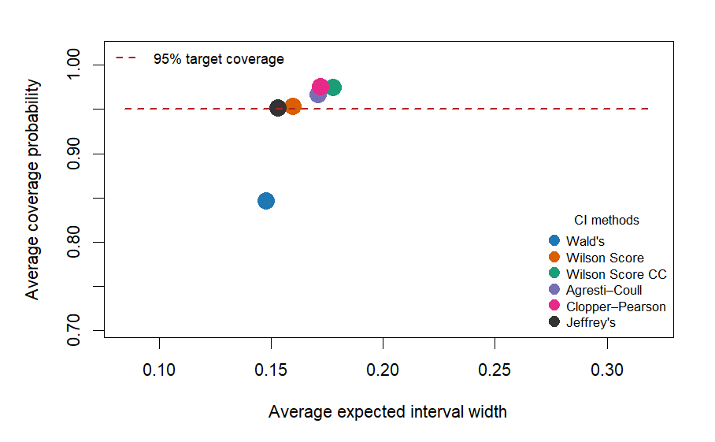
```

```{r coverage-width-n100, echo=FALSE, fig.cap="Average coverage probability against average expected interval width at n = 100.", out.width="80%"}
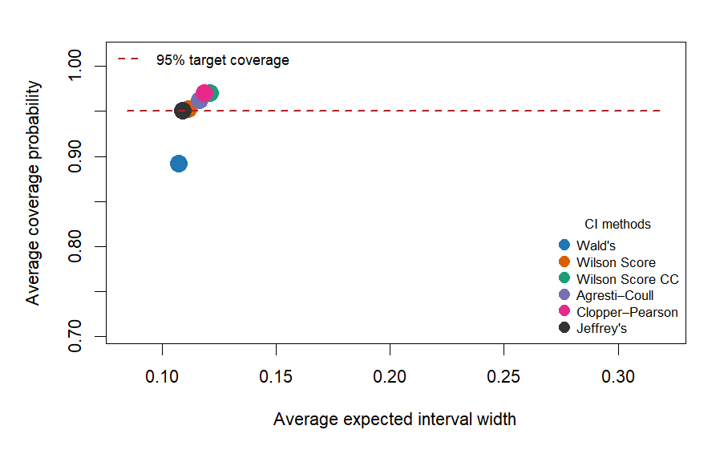
```

At $n = 50$ and $n = 100$ the five non-Wald methods converged, with all five clustered near and above the nominal line in the coverage-width plots. The ordering remained consistent across both sample sizes: Wilson Score and Jeffreys sat closest to 0.95 with average widths of approximately 0.16 and 0.11 at $n = 50$ and $n = 100$ respectively, while Clopper-Pearson produced the widest average intervals at both sample sizes.

## Sample Size and Confidence Interval Method Comparison {#sample-size-and-confidence-interval-method-comparison}

Under the design assumptions established in Section 4.2, the required sample size was determined using the single-arm performance goal framework with an approved performance goal of $p_0 = 0.11$, an assumed true complication proportion of $p_1 = 0.05$, a one-sided significance level of $\alpha = 0.025$ and a target power of 90%. The formal hypotheses were:

$$H_0: p \geq 0.11 \qquad H_1: p < 0.11$$

The Clopper-Pearson interval was used as the primary method for the main sample size calculation. This choice was made partly on the basis of the simulation results in Section 5.2, which showed Clopper-Pearson to be the most conservative method with guaranteed nominal coverage, and additionally because the exact binomial method underlying the Clopper-Pearson interval is the default approach used in widely adopted sample size software including PASS and nQuery [@brown_interval_2001; @clopper_use_1934; @noauthor_pass_nodate; @elashoff_nquery_nodate].

```{r power-curve-cp, echo=FALSE, fig.cap="Power curve for the BioMimics 3D 30-day composite safety endpoint produced by PG-Power using the Clopper-Pearson method. The green point marks the required evaluable sample size of n = 209, at which achieved power was 89.7%.", out.width="90%"}
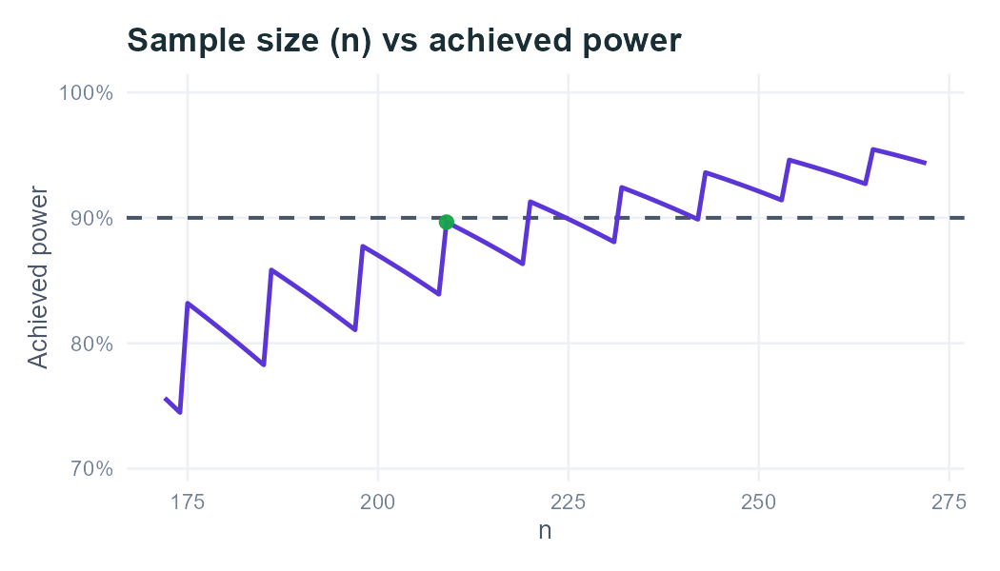
```

The required sample size varied across the six confidence interval methods evaluated under the same design assumptions, as summarised in the table below.

```{r sample-size-table, echo=FALSE, fig.cap="Required evaluable sample size and achieved power for six confidence interval methods under the BioMimics 3D safety endpoint design assumptions. Produced by PG-Power. Clopper-Pearson was set as the primary method.", out.width="80%"}
knitr::include_graphics("Figures/sample_size_comparison_table.png")
```

The Wald interval produced the smallest required sample size of 169 patients but achieved 77.3% power under the assumed true complication proportion, falling to meet the 90% target. This is consistent with the simulation results in Section 5.2, which showed systematic undercoverage of the Wald interval across the relevant range of event proportions [@brown_interval_2001; @agresti_approximate_1998]. A sample size derived from the Wald interval would be unreliable as a basis for study design.

Among the remaining methods, Jeffreys required 198 patients with achieved power of 87.7%, and Wilson Score required 208 patients at 83.9% power, both falling below the 90% target despite requiring larger sample sizes. Clopper-Pearson and Agresti-Coull methods approached the target power, requiring 209 and 210 patients with achieved powers of 89.7% and 89.4% respectively. The Wilson Score with continuity correction required the largest sample size of 247 patients, achieving 92.8% power, consistent with its conservative coverage behaviour observed in Section 5.2.

Notably, Wilson Score required only one fewer patient than Clopper-Pearson but achieved considerably lower power at 83.9% versus 89.7%. The difference between the Clopper-Pearson (209 patients) and Wilson Score with continuity correction (247 patients), represents 38 additional evaluable patients or approximately 42 additional enrolments after dropout adjustment.

```{r ci-diagram, echo=FALSE, fig.cap="Confidence intervals for the observed event proportion across all six methods at n = 209. Produced by PG-Power under the BioMimics 3D safety endpoint design assumptions. The dashed vertical line indicates the performance goal of 11%.", out.width="100%"}
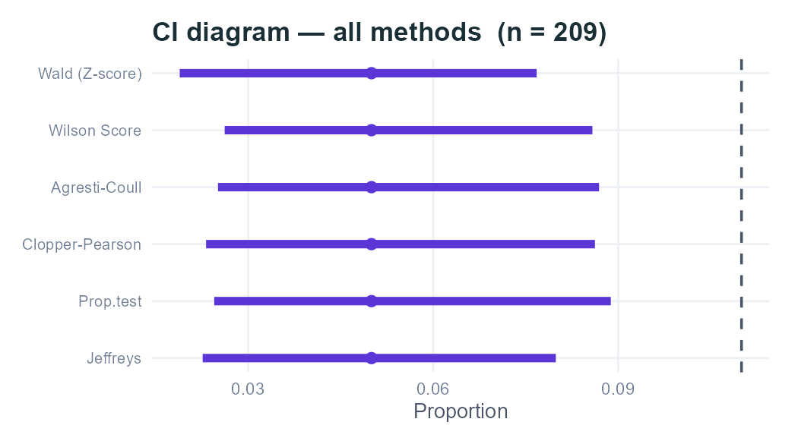
```

A full report generated by the PG-Power application for these design assumptions, including power curves and sensitivity analyses, is available in PDF form on the project GitHub repository (see Appendix).

## Bayesian Historical Borrowing Results {#bayesian-historical-borrowing-results}

Under the $\text{Beta}(2, 48)$ prior and the design assumptions described in Section 4.4, the required evaluable sample size was $n = 79$, permitting no more than 4 observed events. This represents a reduction of 130 patients, approximately 62%, relative to the Clopper-Pearson frequentist result of 209 from Section 5.3.

```{r bayesian-power, echo=FALSE, fig.cap="Bayesian power curve for the BioMimics 3D 30-day composite safety endpoint under a Beta(2, 48) prior (performance goal p0 = 0.11, assumed true proportion p1 = 0.05, one-sided alpha = 0.025, decision threshold 0.95, target power 90%).", out.width="90%"}
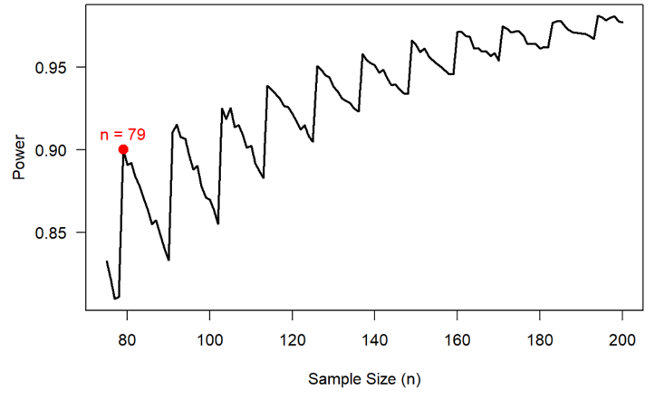
```

The power curve illustrates how achieved power evolves across candidate sample sizes under the Bayesian model. The saw-tooth pattern reflects the same discrete stepwise behaviour described in Section 2.4, where power decreases gradually within ranges of $n$ and increases sharply when an additional event becomes permissible. The required sample size of 79 corresponds to the first point at which the power curve crosses the 90% threshold.

The sensitivity of this result to prior weight is shown in the figure below. All three distributions, $\text{Beta}(0.2, 4.8)$, $\text{Beta}(2, 48)$ and $\text{Beta}(20, 480)$, encode the same underlying event ratio but differ substantially in how strongly they concentrate the posterior.

```{r prior-weight, echo=FALSE, fig.cap="Effect of prior weight on the posterior distribution of the true event proportion theta under three Beta priors with the same event ratio (1:24).", out.width="90%"}
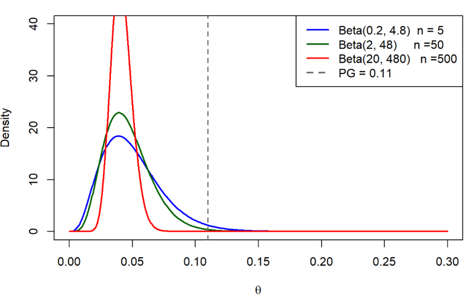
```

With ESS = 5 the posterior is broad and driven largely by the current data, offering modest sample size reduction relative to the frequentist result. With ESS = 50 the posterior concentrates more clearly around the historical event proportion of 4%, well below the performance goal of 11%, producing the reduction to $n = 79$ reported above. With ESS = 500 the posterior is narrow and the prior dominates, largely overriding the current trial data. While this produces the greatest reduction in required sample size, it also renders the conclusion highly sensitive to the validity of the historical data and the exchangeability assumption. If the true event proportion in the current study differs from the historical estimate, a strongly informative prior will pull the posterior toward the historical value regardless of what the current data show. Similarly, the substantial reductions in required sample size correspond to the favourable historical event proportion of 0.04. If the historical event proportion were less favourable or closer to the pre-specified threshold, the resulting reduction in required sample size would be more modest.

\newpage

# Discussion

## Interpretation of Main Findings {#interpretation-of-main-findings}

This study set out to examine how performance goal selection, confidence interval choice and the assumptions underlying the sample size calculation interact to influence design requirements and conclusions in a single-arm performance goal medical device setting. The five aims established in Section 1.5 are addressed in turn before their combined implications are considered.

### Aim 1: Deriving Evidence-Based Performance Goals Through Meta-Analysis

The meta-analysis of three historical femoropopliteal nitinol stent studies yielded a pooled 30-day composite complication proportion of approximately 6%, with the upper confidence limit extending to 12%, and a pooled 12-month Rutherford classification success proportion of approximately 95.8%, with the lower confidence limit at 88%. Confidence interval boundaries rather than point estimates were used to derive the proposed performance goals, acknowledging the uncertainty inherent in a small historical evidence base of only three studies and 116 patients combined. The resulting benchmark values of 12% for safety and 88% for efficacy are therefore point selections derived from ranges of plausible values, with the width of these ranges reflecting the limited precision of the available evidence.

Although using confidence interval limits protects against incorrectly concluding that an effective device does not meet the performance requirement, the choice of benchmark has important consequences for study design and interpretation. First, the value of the selected performance goal within the plausible range of values matters: the sensitivity of sample size requirements to the difference between the proposed 12% and approved 11% thresholds is examined in Aim 3. Second, deriving performance goals from conservative confidence interval boundaries rather than point estimates can introduce biocreep [@eversonstewart_biocreep_2010]. If successive device generations are each evaluated against benchmarks derived from increasingly conservative historical estimates, acceptable performance standards may gradually drift from the original level of clinical effectiveness. This risk is amplified in a single-arm study because there is no active comparator to anchor the comparison [@wang_leveraging_2021; @cao_estimating_2025]. Therefore the validity of the derived benchmarks ultimately depends on the statistical evidence with clinical and regulatory judgement, as methodological approaches alone cannot substitute for clinical context.

### Aim 2: Comparing Confidence Interval Methods for Binary Endpoints

The simulation study confirmed that confidence interval method choice has a meaningful and consistent effect on coverage behaviour at the low event proportions, relevant to the BioMimics 3D safety endpoint. The Wald interval consistently fell below the nominal 95% level, with average coverage of approximately 0.73 at $n = 20$, 0.84 at $n = 50$ and 0.89 at $n = 100$. This undercoverage was not accompanied by any compensating gain in precision: the Wald interval produced average widths comparable to better-performing methods while failing to meet the nominal level throughout. Although its poor behaviour at extreme proportions is well documented in the literature, its inclusion here serves a practical purpose by demonstrating that a method commonly applied by default in standard software would produce unreliable results in this setting [@brown_interval_2001; @agresti_approximate_1998].

Among the remaining five methods, Wilson Score and Jeffreys sat closest to the nominal level with the narrowest intervals, while Clopper-Pearson, Agresti-Coull and the continuity-corrected Wilson Score were consistently conservative with progressively wider intervals. Both Wilson Score and Jeffreys showed dips below the nominal level at very low proportions near $p = 0.001$ to 0.01 [@brown_interval_2001; @pires_interval_2008], which is directly relevant given the expected complication proportion for the BioMimics 3D safety endpoint. The ordering of methods was stable across all sample sizes, providing a consistent basis for method selection in the calculations that followed.

### Aim 3: Evaluating the Effect of Performance Goal and Interval Choice on Sample Size

The sample size results demonstrated that neither the performance goal nor the confidence interval method can be treated as a neutral design choice. Under the approved performance goal of 11% and an assumed true complication proportion of 5%, the required evaluable sample size ranged from 169 patients under the Wald interval, which failed to meet the 90% power target, to 247 under the continuity-corrected Wilson Score. Among the methods approaching the power target, Clopper-Pearson required 209 patients at 89.7% power and Agresti-Coull required 210 at 89.4%, while Jeffreys required 198 patients at 87.7% power and Wilson Score required 208 patients at 83.9% power.

This pattern reflects the saw-tooth structure of power calculations for binary endpoints discussed in Section 2.4 [@brown_interval_2001]. A single additional patient can shift the maximum allowable event count and produce a discrete jump in achieved power, meaning a method requiring slightly fewer patients may achieve substantially lower power if the next event-count threshold has not been crossed. The difference between the most and least demanding reliable methods represents 38 evaluable patients, or approximately 42 additional enrolments after dropout adjustment, illustrating how a statistical design decision made at the planning stage propagates directly into recruitment targets and study cost.

### Aim 4: Developing PG-Power

The PG-Power application provided a transparent and reproducible implementation of the sample size framework, allowing the BioMimics 3D design assumptions to be evaluated consistently across all six confidence interval methods. PG-Power makes the sensitivity of required sample size and achieved power to the choice of confidence interval method immediately visible through visualisations. This supports the deliberate, pre-specified decision-making shown to be necessary in Aims 2 and 3. The full report generated for the BioMimics 3D analysis is available in the GitHub repository (see Appendix).

### Aim 5: The Value and Limits of Bayesian Borrowing

Incorporating a $\text{Beta}(2, 48)$ prior based on a hypothetical Phase II dataset of 50 patients with 2 observed events reduced the required sample size from 209 to 79 patients, a reduction of approximately 62% under the same design assumptions. This illustrates the potential efficiency gains that historical borrowing can offer in a medical device setting where recruitment is costly and historical evidence from comparable devices is available.

However, the magnitude of this reduction is sensitive to the weight assigned to the prior. Increasing the ESS from 5 to 500 while holding the event ratio constant progressively concentrates the posterior around the historical estimate, reducing the required sample size but increasing dependence on the exchangeability assumption and the validity of the historical data. This is particularly relevant when the prior is informed by early-phase evidence, where bias and uncertainty may be greater than in confirmatory studies.

If the historical data are not sufficiently exchangeable with the current population, or if the validity of the historical evidence is uncertain, a strongly informative prior may overly influence the posterior, potentially inflating the Type I error rate and compromising the validity of the trial conclusion [@ibrahim_power_2000; @chiaruttini_bayesian_2025; @gamble_guidelines_2017]. Therefore, the choice of prior weight is a substantive design choice rather than a technical detail.

Early-phase studies are often characterised by small sample sizes, selective patient populations, and limited follow-up, which can result in unstable estimates and reduced external validity. This is a particular concern in the BioMimics context when applying historical evidence to inform the prior. Consequently, the reduction from 209 to 79 patients should be understood as an illustration of the method's potential rather than a design recommendation. Realising that achieving such reductions in practice would require regulatory justification, including formal exchangeability assessment, sensitivity analyses across a range of prior specifications and simulation studies evaluating operating characteristics under scenarios where historical and current data diverge [@ibrahim_power_2000; @chiaruttini_bayesian_2025; @gamble_guidelines_2017].

### Combined Implications

Taken together, the five aims tell a coherent story about the interdependence of statistical design choices in single-arm performance goal studies. The benchmark, the confidence interval method, assumptions underlying the sample size calculation and the incorporation of prior evidence are not independent decisions. Each constrains and is constrained by the others, and the trial's design and conclusion reflects all of them simultaneously.

The meta-analysis established that the performance goal is derived from a range of plausible values, not a fixed estimate. The simulation study showed that the confidence interval method determines both the reliability of the decision rule and the sample size required to achieve a given power. The sample size analysis made this concrete, with an interval-method-driven difference of 38 evaluable patients under identical clinical assumptions. The PG-Power application demonstrated that these calculations can be made transparent and reproducible, and the Bayesian analysis showed that efficiency gains are available from historical borrowing, but only when the underlying assumptions are honestly examined and justified.

The thread running through all five aims is the that identified in Section 1.3. These choices are routinely made in performance goal studies, but their rationale is not always made transparent. The results of this study suggest that the concern Piaggio et al. raised regarding non-inferiority margin reporting extends equally to performance goal methodology, including the preformance goal value, choice of confidence interval method, assumptions underlying the sample size procedure and prior specification [@piaggio_reporting_2012]. These choices are not merely procedural; they can materially influence study conclusions through their impact on sample size requirements and operating characteristics. Consequently, these choices must be explicitly considered, justified, and pre-specified to ensure both scientific integrity and to support a regulatory decision.

## SAP in Performance Goal Studies {#sap-in-performance-goal-studies}

As established in Section 2.6, pre-specifying the SAP before data collection is a regulatory expectation and a prerequisite for reproducible clinical research. The findings of this study make illustrates why this matters in the performance goal setting specifically. The performance goal value, confidence interval method and assumed true event proportion each independently altered the required sample size and the trial conclusion across Sections 5.2 through 5.3, emphasising that none of these choices is neutral. A confidence interval method selected post-hoc in light of favourable results, or a performance goal derived after reviewing the data, would undermine the validity of the study conclusion regardless of the quality of the underlying clinical evidence [@piaggio_reporting_2012; @kahan_how_2020].

The 38-patient difference in required sample size between the most and least demanding reliable confidence interval methods identified in Section 5.3 illustrates concretely what is at stake at the design stage. PG-Power directly supports this process by allowing the sensitivity of sample size requirements to method choice, performance goal value and dropout assumptions to be examined transparently before the SAP is finalised. Documenting these outputs alongside the chosen method and its justification provides a transparent and reproducible record of the design rationale, which is essential for regulatory assessment and independent review of the validity and robustness of the study’s conclusions [@international_council_for_harmonisation_statistical_1998; @gamble_guidelines_2017].

## Study Limitations {#study-limitations}

The most important limitation of this study is the restricted historical evidence base. The meta-analysis drew on only three studies comprising 116 patients, identified through a single guidance document rather than a systematic literature search. This limits both the precision of the pooled estimates and the ability to reliably characterise between-study heterogeneity. The wide confidence intervals around the $I^2$ statistics for both endpoints mean that the derived performance goals carry substantial uncertainty, and a more comprehensive search of the literature might have identified additional comparable studies that could have narrowed that uncertainty or shifted the pooled estimates [@wang_leveraging_2021].

Relatedly, the performance goal derivation focused on a single guidance document developed in 2007. Clinical practice in femoropopliteal intervention has evolved considerably since then, and it is possible that more recent device studies would yield different pooled estimates [@rammos_biomimics_2024; @zeller_helical_2016]. The external validity of the derived benchmarks to a contemporary BioMimics 3D pivotal study therefore cannot be assumed without further review of the current literature [@eversonstewart_biocreep_2010].

The simulation study was conducted over a proportion range of $p \in \{0.001, \ldots, 0.200\}$ at sample sizes of $n = 20$, 50 and 100. While this range and these sample sizes are appropriate for the BioMimics 3D safety endpoint, the conclusions may not generalise to settings with higher event proportions, larger studies or endpoints near $p = 0.5$. The simulation also evaluated methods solely on coverage probability and expected interval width. Other properties, such as the location of the interval relative to the true proportion or tail behaviour at extreme values, were not examined [@brown_interval_2001; @pires_interval_2008].

The Bayesian analysis used a hypothetical Phase II dataset rather than the actual historical studies as the basis for the prior. While this was a deliberate choice to illustrate the method under transparent and controlled assumptions, it means the sample size reduction reported in Section 5.4 cannot be directly interpreted as a realistic design recommendation for a BioMimics 3D pivotal study. A fully justified prior would require a more thorough assessment of exchangeability, potentially involving clinical experts and formal heterogeneity testing across a broader evidence base than was available here [@ibrahim_power_2000; @chiaruttini_bayesian_2025; @gamble_guidelines_2017].

Finally, this study focused exclusively on single-arm performance goal designs with binary endpoints. Many medical device studies involve time-to-event endpoints, continuous outcomes or repeated measures [@chow_sample_2017; @wang_sample_2020], and the methods developed here do not extend directly to those settings. The conclusions are therefore specific to the single-arm binary endpoint framework and should not be generalised beyond it without further methodological work.

## Directions for Future Research {#directions-for-future-research}

The most immediate extension of this work would be a systematic literature search to replace the single 2007 guidance document used as the historical evidence base. With only three contributing studies available, the derived performance goals carry considerable uncertainty, and more recent femoropopliteal device studies may yield meaningfully different pooled estimates. A broader evidence base would also permit formal assessment of publication bias, which was not possible here [@wang_leveraging_2021].

The simulation study could be extended to higher event proportions, larger sample sizes and a wider set of operating characteristics beyond coverage probability and expected interval width [@brown_interval_2001; @pires_interval_2008]. Applying the same simulation and sample size framework to the 12-month Rutherford classification efficacy endpoint would also complete the BioMimics 3D design picture, and a joint power calculation considering both endpoints simultaneously would be a natural further step.

The Bayesian borrowing analysis would benefit from formalisation. This would require a formal exchangeability assessment drawing on clinical expert judgement, sensitivity analyses across a range of prior specifications including the power prior and robust mixture prior approaches introduced in Section 2.5, and simulation studies evaluating operating characteristics under scenarios where historical and current data diverge [@ibrahim_power_2000; @chiaruttini_bayesian_2025; @gamble_guidelines_2017]. Incorporating this into PG-Power as a Bayesian module, alongside extensions to time-to-event endpoints and two-arm designs, would substantially broaden the application's utility for medical device trial planning.

Finally, empirical validation against actual BioMimics 3D pivotal study data, if it were to become available, would allow the performance goal framework and confidence interval method rankings developed here to be tested against real clinical outcomes rather than simulated ones.

\newpage

# Conclusion {.unnumbered}

This thesis examined how three interconnected statistical choices, the performance goal value, confidence interval method and assumptions underlying the sample size calculation, interact to shape the design and conclusion of a single-arm performance goal study. Using the BioMimics 3D vascular stent as a case study, demonstrated that none of these choices is neutral and that each can alter the trial conclusion independently of the underlying clinical data.

The meta-analysis of three historical femoropopliteal nitinol stent studies yielded pooled estimates of approximately 6% for the 30-day composite safety endpoint and 95.8% for the 12-month Rutherford classification efficacy endpoint. Deriving performance goals from confidence interval boundaries rather than point estimates produced benchmarks of 12% for safety and 88% for efficacy, acknowledging the uncertainty inherent in a small and imprecise historical evidence base. The width of the uncertainty around these estimates illustrated that performance goals are rarely as settled as they appear when reported as single values, and that the reasoning behind them carries as much weight as the numbers themselves.

The simulation study showed that confidence interval method choice has a consistent and meaningful effect on coverage behaviour at the low event proportions characteristic of medical device safety endpoints. The Wald interval consistently fell below the nominal 95% coverage level making it unsuitable for this setting [@brown_interval_2001]. Wilson Score and Jeffreys achieved coverage closest to the nominal level with relatively narrow intervals, while Clopper-Pearson, Agresti-Coull and the continuity-corrected Wilson Score provided conservative coverage with wider intervals. These differences translated directly into differences in sample size requirements, ranging from 169 patients under the Wald to 247 patients under the continuity-corrected Wilson Score despite identical design assumptions.

The Bayesian historical borrowing analysis demonstrated that incorporating prior evidence through a $\text{Beta}(2, 48)$ prior reduced the required sample size from 209 to 79 patients, a reduction of approximately 62%. This reduction was sensitive to the credibility of the historical evidence informing the prior and the weight assigned to the prior. Stronger borrowing increased dependence on the exchangeability assumption creating a greater risk of inflating the Type I error rate. The analysis established the potential of Bayesian borrowing as a complementary approach to the frequentist framework, contingent on careful prior specification and formal exchangeability assessment.

The PG-Power application provided a transparent and reproducible implementation of the sample size framework, making the sensitivity of required sample size to design assumptions immediately visible and supporting the pre-specified decision-making that the results consistently point toward.

Taken together, these findings reinforce a conclusion that extends beyond the BioMimics 3D case study. The concern raised in Section 1.3, that performance goals and statistical methods are often presented without explanation, applies to the benchmark itself and to the confidence interval method, sample size procedure and prior specification [@piaggio_reporting_2012]. Each of these choices shape the trial conclusion before a patient is enrolled. Making them explicit, justified and pre-specified in the SAP is not a procedural formality, but the foundation on which a credible and reproducible performance goal study rests.

\newpage

# Appendix {.unnumbered}

## Project GitHub Repository {.unnumbered}

All materials associated with this thesis are publicly available at:

<https://github.com/FilipMKgit/MDX2526>

The repository contains the PG-Power R Shiny application with full source code and documentation, a PDF report generated by PG-Power for the BioMimics 3D safety endpoint analysis under the design assumptions described in Section 2.4, the R simulation code used to produce the results in Section 5.2, the thesis document in both Word and Rmd formats, and supporting project materials including the research poster and presentation slides.

\newpage
\renewcommand{\refname}{}

# References {.unnumbered}
