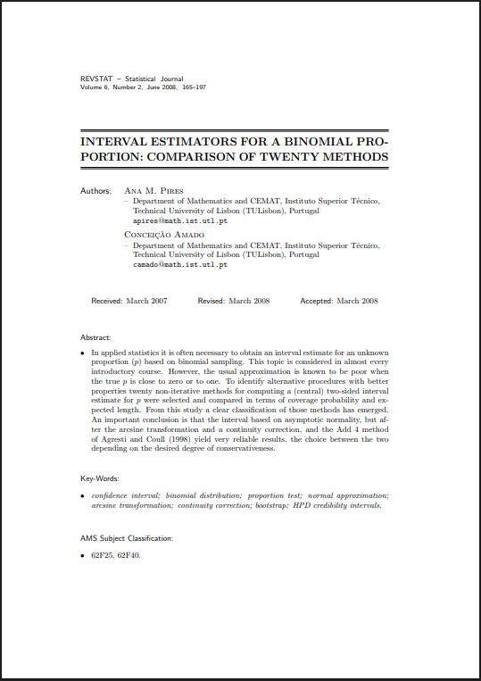

```{r setup}
library(tidyverse)
library(kableExtra)
library(dplyr)
library(readxl)
library(meta)
library(cowplot)
library(binom)
```

# Section One {background-color="#5A3A6E"}

-   Discuss Non-Inferiority & Performance Goal Studies
-   Describe our Case Study
-   Determine Performance Endpoints

## Non-Inferiority vs Performance Goal Studies {.text-sm}

::::: columns
::: {.column width="55%"}
**Aim:** To show that the new treatment is no worse in safety & efficacy than current standard of care.

1.  **Randomized Control Study**: A 2-arm study between a new treatment & active control where the new treatment & confidence interval must be within the **non-inferiority margin** of the control's performance.

2.  **Performance Goal Study**: A single-arm study where results are benchmarked against predefined performance goals. Typical for medical devices as blinding is impractical and/or an active control is financially unjustifiable.
:::

::: {.column width="45%"}
{width="100%"}

{fig-align="center" width="302"}
:::
:::::

## How are Performance Goals Calculated?

:::::: columns
::: {.column width="60%"}
Performance Goals define the **worst acceptable outcome** a new device must beat to be approved.

**Process:**

1.  Identify comparable approved devices
2.  Get their safety & efficacy preformances from their clinical studies
3.  Propose these PGs to regulatory authorities (FDA) for approval
4.  Authorities can accept, reject, or modify based on clinical rationale
:::

:::: {.column width="40%"}
::: purple-box
**Safety:** Maximum acceptable harm

**Efficacy:** Minimum acceptable clinical benefit preserved
:::
::::
::::::

## Case Study:

:::::: columns
::: {.column width="60%"}
The BioMimics 3D Stent Study:

A pivotal single-arm performance goal study for a peripheral vascular stent (to treat peripheral vascular disease).

Goal:

1.  Propose performance goal endpoints for safety & efficacy to show to regulatory authorities.

2.  Demonstrate that the new treatment stays below/ above the approved performance goals.
:::

:::: {.column width="40%"}
{width="100%"}

::: success-box
😊 If both preformance goals are met – the treatment successfully demonstrates non-inferiority 😊
:::
::::
::::::

## Proposed Performance Goal Endpoints:

Step 1. Conduct a targeted literature review of clinical trials of comparable stents.

Step 2. Conduct an aggregate-level meta-analysis using a 2007 FDA guidance document

::: purple-box
*'Performance Goals and Endpoint Assessments for Clinical Trials of Femoropopliteal Bare Nitinol Stents in Patients with Symptomatic Peripheral Arterial Disease'*
:::

This guidance document comprises three studies of similar stents assessing the primary endpoints for safety & efficacy.

## Proposed Endpoints:

**Safety (30-day):** Maximum acceptable level of harm

-   Amputation
-   Death
-   Target Vessel Revascularisation (TVR)
-   **Primary composite (Combined amputation, death, TVR)**

**Efficacy (12-month):** Minimum clinical benefit that must be preserved

-   **Rutherford Classification Change (improved/stable, worsened by x1, worsened by x2)**

## Metaanalysis:

A logit-transformation was applied (*extreme proportions*), variance was pooled using a generalised linear mixed model (*robust with sample sample sizes*), with study-level variances drawn from each study's observed proportion (*not assuming homogeneity accross studies*).

-   The upper/lower confidence interval bounds — rather than the point estimate — were proposed to the regulators as the performance goal thresholds.

-   With only 3 studies available, confidence intervals are wide; this conservatism works in our favour, as wider intervals produce more favourable upper/lower bounds


## Performance Goals & Decision Criteria

::::: columns
::: {.column width="43%"}
```{r tbl-pg2}
pg2 <- data.frame(
  `Endpoint` = c("Composite (Death, Amputation, TVR)",
                 "RCC Score 1: Improved / No Change"),
  `Pooled Rate (95% CI)` = c("6.0%  [2.9–12.1%]",
                              "95.8%  [87.9–98.6%]"),
  `Performance Goal` = c("≤ 12%", "≥ 88%"),
  check.names = FALSE
)

kable(pg2, align = c("l","c","c")) %>%
  kable_styling(bootstrap_options = c("condensed"),
                full_width = TRUE, font_size = 16) %>%
  pack_rows("Safety — 30 Days", 1, 1,
            label_row_css = "background-color:#2C2C6C; color:white; font-weight:bold;") %>%
  pack_rows("Efficacy — 12 Months", 2, 2,
            label_row_css = "background-color:#5C3D1E; color:white; font-weight:bold;") %>%
  row_spec(0, bold = TRUE, background = "#2C2C6C", color = "white") %>%
  column_spec(1, width = "50%", bold = TRUE) %>%
  column_spec(3, bold = TRUE, color = "#2C2C6C")
```
:::

::: {.column width="57%"}
```{r pg-plot, fig.height=4.8, fig.width=6.2}
library(patchwork)

# ── Safety panel ──────────────────────────────────────────────
safety_df <- data.frame(
  label    = c("Fail: upper CI\ncrosses PG", "Pass: upper CI\nwithin PG"),
  estimate = c(0.08, 0.06),
  lower    = c(0.03, 0.025),
  upper    = c(0.145, 0.095),
  result   = c("Fail", "Pass")
)

p_safety <- ggplot(safety_df, aes(y = label, x = estimate, colour = result)) +
  annotate("rect", xmin = 0.12, xmax = Inf,  ymin = -Inf, ymax = Inf,
           fill = "#ffcccc", alpha = 0.4) +
  annotate("rect", xmin = -Inf, xmax = 0.12, ymin = -Inf, ymax = Inf,
           fill = "#cceecc", alpha = 0.4) +
  geom_vline(xintercept = 0.12, linetype = "dashed",
             colour = "#2C2C6C", linewidth = 1.1) +
  geom_errorbarh(aes(xmin = lower, xmax = upper),
                 height = 0.25, linewidth = 1.2) +
  geom_point(size = 4) +
  annotate("text", x = 0.121, y = 2.4, label = "PG = 12%",
           hjust = 0, colour = "#2C2C6C", fontface = "bold", size = 3.5) +
  scale_colour_manual(values = c("Pass" = "#2e7d32", "Fail" = "#c62828")) +
  scale_x_continuous(labels = scales::percent_format(accuracy = 1),
                     limits = c(0, 0.22)) +
  labs(title = "Safety — 30-Day Composite",
       subtitle = "Upper CI must stay below 12%",
       x = "Proportion", y = NULL, colour = NULL) +
  theme_minimal(base_size = 11) +
  theme(legend.position = "none",
        plot.title    = element_text(colour = "#2C2C6C", face = "bold"),
        plot.subtitle = element_text(size = 9))

# ── Efficacy panel ────────────────────────────────────────────
efficacy_df <- data.frame(
  label    = c("Fail: lower CI\ncrosses PG", "Pass: lower CI\nwithin PG"),
  estimate = c(0.925, 0.958),
  lower    = c(0.855, 0.895),
  upper    = c(0.975, 0.985),
  result   = c("Fail", "Pass")
)

p_efficacy <- ggplot(efficacy_df, aes(y = label, x = estimate, colour = result)) +
  annotate("rect", xmin = -Inf, xmax = 0.88, ymin = -Inf, ymax = Inf,
           fill = "#ffcccc", alpha = 0.4) +
  annotate("rect", xmin = 0.88, xmax = Inf,  ymin = -Inf, ymax = Inf,
           fill = "#cceecc", alpha = 0.4) +
  geom_vline(xintercept = 0.88, linetype = "dashed",
             colour = "#5C3D1E", linewidth = 1.1) +
  geom_errorbarh(aes(xmin = lower, xmax = upper),
                 height = 0.25, linewidth = 1.2) +
  geom_point(size = 4) +
  annotate("text", x = 0.881, y = 2.4, label = "PG = 88%",
           hjust = 0, colour = "#5C3D1E", fontface = "bold", size = 3.5) +
  scale_colour_manual(values = c("Pass" = "#2e7d32", "Fail" = "#c62828")) +
  scale_x_continuous(labels = scales::percent_format(accuracy = 1),
                     limits = c(0.80, 1.0)) +
  labs(title = "Efficacy — RCC Improved/No Change (12 months)",
       subtitle = "Lower CI must stay above 88%",
       x = "Proportion", y = NULL, colour = NULL) +
  theme_minimal(base_size = 11) +
  theme(legend.position = "none",
        plot.title    = element_text(colour = "#5C3D1E", face = "bold"),
        plot.subtitle = element_text(size = 9))

p_safety / p_efficacy +
  plot_annotation(
    title = "NI Decision: CI must fall in the green zone for both endpoints",
    theme = theme(plot.title = element_text(size = 11, face = "bold",
                                            hjust = 0.5, colour = "#333333"))
  )
```
:::
:::::

# Section Two {background-color="#5A3A6E"}

-   Confidence Intervals for Proportions
-   Simulation Study
-   Sample Size Calculation
-   Shiny App
-   Final Steps

# Confidence Intervals for proportions

## 

::::::: columns
::: {.column width="30%"}
{width="100%"}

**Complications** = lower boundary
:::

:::: {.column width="10%"}
::: {style="border-left: 2px solid gray; height: 100%; margin: auto;"}
:::
::::

::: {.column width="45%"}
{width="100%"}

**High Success Rate** = upper boundary
:::
:::::::

## Wald's Confidence Interval

$$\hat{p} \;\pm\; z_{1-\alpha/2}\sqrt{\frac{\hat{p}(1-\hat{p})}{n}}$$

::::: columns
::: {.column width="25%"}
{width="100%"}
:::

::: {.column width="75%"}
-   Assumes $\hat{p}$ is normally distriubuted
    -   Impossible CI bounds, not within \[0,1\]
    -   Underestimates uncertainty at bounderies
    -   Poor coverage, below nominal 95% power
:::
:::::

## 

```{r wald-coverage, echo=FALSE, fig.cap="Wald interval coverage across a range of true proportions when n = 20. For small values of p (shaded region), coverage falls well below 95%."}
set.seed(2026)
n     <- 20
n_sim <- 5000
p_vals <- seq(0.001, 0.5, by = 0.002)
z_95   <- qnorm(0.975)

cov_vals <- sapply(p_vals, function(p) {
  x     <- rbinom(n_sim, size = n, prob = p)
  p_hat <- x / n
  lower <- p_hat - z_95 * sqrt(p_hat * (1 - p_hat) / n)
  upper <- p_hat + z_95 * sqrt(p_hat * (1 - p_hat) / n)
  mean(lower <= p & upper >= p)
})

p_cut <- 0.1
idx   <- p_vals <= p_cut
y_cut <- cov_vals[which.min(abs(p_vals - p_cut))]
par(mar = c(5, 5, 4, 2))
plot(p_vals, cov_vals, type = "l", lwd = 2, ylim = c(0, 1),
     xlab = "True proportion (p)", ylab = "Coverage probability",
     main = "Wald Interval: Coverage Probability Across True Proportions")
polygon(x = c(p_vals[idx], rev(p_vals[idx])),
        y = c(cov_vals[idx], rep(0, sum(idx))),
        col = rgb(1, 0, 0, alpha = 0.15), border = NA)
lines(p_vals, cov_vals, lwd = 2)
abline(h = 0.95, lty = 2)
segments(x0 = p_cut, y0 = 0, x1 = p_cut, y1 = y_cut, lty = 3, col = "grey40")
legend("bottomright",
       legend = c("Wald coverage", "Nominal 95%", "Small p region"),
       lty = c(1, 2, NA), lwd = c(2, 1, NA), pch = c(NA, NA, 15),
       col = c("black", "black", rgb(1, 0, 0, 0.3)), pt.cex = 2, bty = "n")
```

## Alternatives

-   Wilson Score Interval
-   Wilson Score Interval *(with continuity correction)*
-   Agresti–Coull Interval
-   Clopper–Pearson Interval
-   Jeffreys Interval

## Wilson Score Interval

$$
\frac{
\hat{p} + \dfrac{z^2}{2n}
\;\pm\;
z \sqrt{
\dfrac{\hat{p}(1 - \hat{p})}{n} + \dfrac{z^2}{4n^2}
}
}{
1 + \dfrac{z^2}{n}
}
$$

-   Inverts score test for a binomial proportion

-   Keep values of $p$ that would **not be rejected** by the observed data

## 

-   Wald deems estimate to be center of interval

-   Wilson fixes that with:

$$
\tilde{p}
=
\frac{
\hat{p} + \dfrac{z^2}{2n}
}{
1 + \dfrac{z^2}{n}
}
$$

Adjusting center of interval

$$
\dfrac{z^2}{2n}
$$

Pulls centre away from 0 or 1

## Wilson Score Interval *(with continuity correction)*

$$
\text{derived from a score test:}
\quad
\frac{(\hat{p} - p)^2}{\hat{p}(1-\hat{p})/n}
$$

-   **Prop.test comes in `stats` package which is loaded with base R**

    -   Essentially Wilson Score Interval with *continuity correction enabled by default*

-   *Real name: Wilson score interval with continuity correction*

-   Also a test inversion

    -   Keep values of $p$ that would **not be rejected** by the observed data
    -   **Continuity correction**
        -   Adjusts the cutoff by .5

## Agresti-Coull Interval

$$
\hat{p} = \frac{x}{n}
\qquad \longrightarrow \qquad
\tilde{p} = \frac{x + 2}{n + 4}
$$

Then calculates CI:

$$
\tilde{p}
\;\pm\;
1.96
\sqrt{
\frac{
\tilde{p}(1-\tilde{p})
}{
n+4
}
}
$$

*Essentially improved **Wald with pseudo-observations***

## Clopper-Pearson Interval

$$
\left[
\mathrm{Beta}^{-1}\!\left(\tfrac{\alpha}{2};\; x,\; n - x + 1\right),
\;\;
\mathrm{Beta}^{-1}\!\left(1 - \tfrac{\alpha}{2};\; x + 1,\; n - x\right)
\right]
$$

-   Based on **exact** binomial distribution

    $$
    X \sim \text{Binomial}(n, p)
    $$

-   Inverts the exact binomial test

    -   Keep values of $p$ that would **not be rejected** by the observed data

## Jeffrey Interval

$$
\left[
\mathrm{Beta}^{-1}\!\left(\tfrac{\alpha}{2};\; x + \tfrac{1}{2},\; n - x + \tfrac{1}{2}\right),
\;\;
\mathrm{Beta}^{-1}\!\left(1 - \tfrac{\alpha}{2};\; x + \tfrac{1}{2},\; n - x + \tfrac{1}{2}\right)
\right]
$$

Also assumes binomial distribution

$$
X \sim \text{Binomial}(n, p)
$$

-   Based on Bayesian idea

    -   Works well for frequentist problems

-   Start with weak prior beliefs on $p$

$$
p \sim \mathrm{Beta}\left(\frac{1}{2}, \frac{1}{2}\right)
$$

# Simulation Study

## Framework

::: {.column width="35%"}
{width="100%"}
:::

::: {.column width="65%"}
**Pires & Amado (2008):** *Interval estimators for a binomial proportion: Comparison of twenty methods*

-   Behaviour evaluated under:

    -   Coverage probability

    -   Expected width of 95% CI

    -   Wi
:::

## Coverage Probability

```{r coverage-function, echo=FALSE}
coverage_plot_binom <- function(n = 50,
                                p_grid = seq(0.001, 0.2, by = 0.001),
                                methods = c("exact", "asymptotic", "agresti-coull",
                                            "wilson", "prop.test", "jeffreys"),
                                conf.level = 0.95, plot = TRUE) {
  if (!requireNamespace("binom", quietly = TRUE)) stop("Package 'binom' is required.")
  get_ci <- function(x, n, method, conf.level) {
    alpha <- 1 - conf.level
    if (method == "jeffreys") {
      lower <- ifelse(x == 0, 0, qbeta(alpha / 2,     x + 0.5, n - x + 0.5))
      upper <- ifelse(x == n, 1, qbeta(1 - alpha / 2, x + 0.5, n - x + 0.5))
      data.frame(lower = lower, upper = upper)
    } else {
      ci <- binom::binom.confint(x, n, conf.level = conf.level, methods = method)
      data.frame(lower = ci$lower, upper = ci$upper)
    }
  }
  compute_coverage <- function(method) {
    coverage <- numeric(length(p_grid))
    for (i in seq_along(p_grid)) {
      p <- p_grid[i]; x_vals <- 0:n; probs <- dbinom(x_vals, size = n, prob = p)
      ci <- get_ci(x_vals, n, method, conf.level)
      coverage[i] <- sum(probs * ((ci$lower <= p) & (ci$upper >= p)))
    }
    data.frame(p = p_grid, coverage = coverage, method = method)
  }
  results <- do.call(rbind, lapply(methods, compute_coverage))
  method_labels <- c("exact" = "Clopper–Pearson", "asymptotic" = "Wald",
                     "agresti-coull" = "Agresti–Coull", "wilson" = "Wilson",
                     "prop.test" = "Prop.test", "jeffreys" = "Jeffreys")
  results$method <- factor(results$method, levels = names(method_labels),
                           labels = method_labels[names(method_labels) %in% methods])
  if (plot) {
    layout <- if (length(unique(results$method)) <= 4) c(2,2) else c(2,3)
    par(mfrow = layout, mar = c(3,3,2.5,1), oma = c(2,2,2,1))
    for (m in levels(results$method)) {
      dat <- results[results$method == m, ]
      plot(dat$p, dat$coverage, type = "l", lwd = 1.8, col = "#2c7bb6",
           main = m, xlab = "", ylab = "", ylim = range(c(dat$coverage, conf.level)))
      abline(h = conf.level, lty = "dashed", col = "firebrick")
    }
    mtext("True proportion (p)", side = 1, outer = TRUE, line = 0.5)
    mtext("Coverage probability", side = 2, outer = TRUE, line = 0.5)
    mtext(paste0("Coverage probability by method  |  n = ", n, ",  α = ", 1 - conf.level),
          side = 3, outer = TRUE, line = 0.5, font = 2)
  }
  invisible(results)
}
```

## 

```{r cp-n50, echo=FALSE, fig.cap="Coverage probability for each method (n = 50). Dashed red = nominal 95%."}
coverage_plot_binom(n = 50)
```

## 

```{r cp-n200, echo=FALSE, fig.cap="Coverage probability for each method (n = 200). Dashed red = nominal 95%."}
coverage_plot_binom(n = 200)
```

## Expected CI Width

```{r width-function, echo=FALSE}
expected_width_vs_p_binom <- function(n = 20,
                                      p_grid = seq(0.001, 0.2, by = 0.001),
                                      methods = c("asymptotic", "wilson",
                                                  "agresti-coull", "exact", "jeffreys"),
                                      conf.level = 0.95, plot = TRUE) {
  if (!requireNamespace("binom", quietly = TRUE)) stop("Package 'binom' is required.")
  get_ci <- function(x, n, method, conf.level) {
    alpha <- 1 - conf.level
    if (method == "jeffreys") {
      lower <- ifelse(x == 0, 0, qbeta(alpha / 2,     x + 0.5, n - x + 0.5))
      upper <- ifelse(x == n, 1, qbeta(1 - alpha / 2, x + 0.5, n - x + 0.5))
      data.frame(lower = lower, upper = upper)
    } else {
      ci <- binom::binom.confint(x, n, conf.level = conf.level, methods = method)
      data.frame(lower = ci$lower, upper = ci$upper)
    }
  }
  compute_width <- function(method) {
    exp_width <- numeric(length(p_grid))
    for (i in seq_along(p_grid)) {
      p <- p_grid[i]; x_vals <- 0:n; probs <- dbinom(x_vals, size = n, prob = p)
      ci <- get_ci(x_vals, n, method, conf.level)
      exp_width[i] <- sum(probs * (ci$upper - ci$lower))
    }
    data.frame(p = p_grid, expected_width = exp_width, method = method)
  }
  results <- do.call(rbind, lapply(methods, compute_width))
  method_labels <- c("asymptotic" = "Wald", "wilson" = "Wilson",
                     "agresti-coull" = "Agresti–Coull", "exact" = "Clopper–Pearson",
                     "jeffreys" = "Jeffreys")
  results$method <- factor(results$method, levels = methods, labels = method_labels[methods])
  if (plot) {
    method_cols <- c("#e41a1c", "#377eb8", "#4daf4a", "#984ea3", "#ff7f00")
    par(mar = c(5, 5, 4, 12), xpd = TRUE)
    plot(NA, NA, xlim = range(p_grid), ylim = range(results$expected_width),
         xlab = "True proportion (p)", ylab = "Expected interval width",
         main = paste0("Expected Width of ", round(conf.level*100), "% CIs  |  n = ", n))
    for (i in seq_along(levels(results$method))) {
      m <- levels(results$method)[i]; dat <- results[results$method == m, ]
      lines(dat$p, dat$expected_width, lwd = 2, lty = i, col = method_cols[i])
    }
    legend("topright", inset = c(-0.42, 0), legend = levels(results$method),
           lwd = 2, lty = seq_along(levels(results$method)), col = method_cols, bty = "n")
  }
  invisible(results)
}
```

```{r width-plot, echo=FALSE}
expected_width_vs_p_binom()
```

## Cov

Which interval on average has the highest coverage (normal coverage) vs on average the narrowest CI?

## Insight Summary

-   **Agresti–Coull** interval appears to be a strong choice
-   Similar coverage to Wilson with narrower intervals
-   Well suited to small proportions in single-arm device trials

# Sample Size Calculation

## Safety Endpoint

-   Proposed Safety Endpoint for Composite (Death, Amputation, TVR): **≤ 12%**
-   Approved Safety Endpoint for Composite (Death, Amputation, TVR): **≤ 11%**

| Parameter                     | Value             |
|-------------------------------|-------------------|
| Significance                  | 0.025 (one-sided) |
| Power                         | 90%               |
| Approved Safety Endpoint Rate | 0.11              |
| Assumed Safety Endpoint Rate  | 0.05              |

## Software Comparison

::::: columns
::: {.column width="20%"}

:::

::: {.column width="80%"}
**NCSS PASS** n = 220
:::
:::::

::::: columns
::: {.column width="20%"}

:::

::: {.column width="80%"}
**nQuery** n = 232
:::
:::::

::::: columns
::: {.column width="20%"}

:::

::: {.column width="80%"}
**R EnvStats** n = 220 \| **R binom** n = 256
:::
:::::

## 

```{r ss-plot, echo=FALSE, message=FALSE, warning=FALSE}
N <- 150:270; Alpha <- 0.025; Pow <- 0.90; p0 <- 0.89; p1 <- 0.95
CritVal <- qbinom(p = 1 - Alpha, size = N, prob = p0)
Beta    <- pbinom(q = CritVal, size = N, prob = p1)
Power   <- 1 - Beta

method_n <- c("NCSS PASS & R EnvStats" = 220, "nQuery" = 232, "R binom" = 256)
method_power <- Power[match(method_n, N)]
legend_labels <- paste0(names(method_n), ": n = ", method_n, ", power = ", round(method_power, 3))

plot(N, Power, type = "b", las = 1, xlab = "n", ylab = "Power",
     ylim = c(0.65, 1), yaxt = "n",
     main = paste("One-sided sample size comparison for 30-day TVR\nPG =",
                  1 - p0, "| Expected TVR =", 1 - p1, "| Target power =", Pow),
     cex.main = 0.9)
axis(side = 2, at = c(0.65, 0.90, 1.00), labels = c("0.65", "0.90", "1.00"), las = 1)
abline(h = Pow, lty = "dashed")
points(method_n, method_power, pch = 19, col = c("red", "darkgreen", "orange"), cex = 1.4)
legend("bottomright",
       legend = c("Power curve", "Target power", legend_labels),
       col = c("black", "black", "red", "darkgreen", "orange"),
       lty = c(1, 2, NA, NA, NA), pch = c(1, NA, 19, 19, 19), bty = "n", cex = 0.72)
```

# Shiny App {background-color="#5A3A6E"}

## PG-Power

-   Posit Cloud

-   Github

-   \[INSERT LOGO\]

## Next Steps

-   **Gatekeeping approach:** safety must be demonstrated before efficacy is analysed.
-   Explore **joint Bayesian modelling** of safety & efficacy simultaneously.
-   Incorporate historical data using a **Bayesian weighting framework**.
-   Finalise the **Statistical Analysis Plan (SAP)** specifying endpoints, estimators, CI methods, and NI decision rules prior to data unblinding.

# Thank You {background-color="#5A3A6E"}

**Áine Glynn & Filip Kłosowski** \| School of Mathematical and Statistical Sciences, University of Galway

## References {.smaller}

-   Cuzick & Sasieni (2022). doi: 10.1038/s41416-022-01937-w
-   Sandie et al. (2022). doi: 10.1186/s13063-022-06118-x
-   FDA (2016). Non-Inferiority Clinical Trials to Establish Effectiveness. https://www.fda.gov/media/78504/download
-   Werk et al. (2008). doi: 10.1161/CIRCULATIONAHA.107.735985
-   Tepe et al. (2008). doi: 10.1056/NEJMoa0706356
-   Pires & Amado (2008). Interval estimators for a binomial proportion: Comparison of twenty methods. *REVSTAT*
