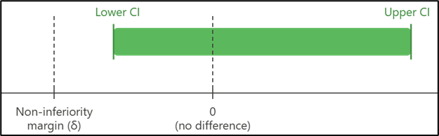
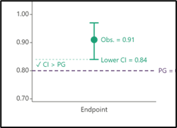
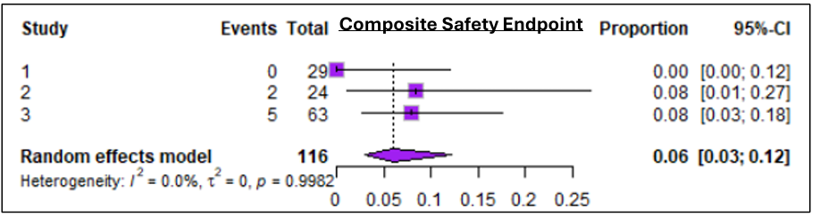
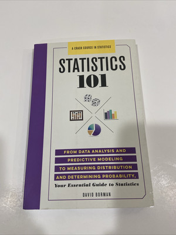
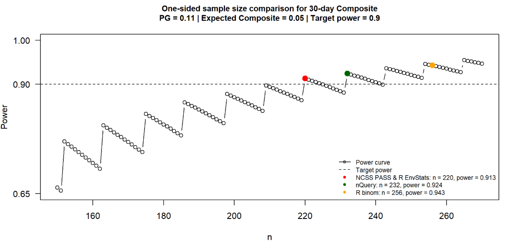

```{r setup}
library(tidyverse)
library(kableExtra)
library(dplyr)
library(readxl)
library(meta)
library(cowplot)
library(binom)
```

# Section One {background-color="#5A3A6E"}

- Discuss Non-Inferiority & Performance Goal Studies
- Describe our Case Study
- Determine Performance Endpoints

## Non-Inferiority vs Performance Goal Studies {.text-sm}

::::: columns
::: {.column width="55%"}
**Aim:** To show that the new treatment is no worse in safety & efficacy than current standard of care.

1.  **Randomized Control Study**: A 2-arm study between a new treatment & active control where the new treatment & confidence interval must be within the **non-inferiority margin** of the control's performance.

2.  **Performance Goal Study**: A single-arm study where results are benchmarked against predefined performance goals. Typical for medical devices as blinding is impractical and/or an active control is financially unjustifiable.
:::

::: {.column width="45%"}
{width="100%"}

{fig-align="center" width="302"}
:::
:::::

## How are Performance Goals Calculated?

:::::: columns
::: {.column width="60%"}
Performance Goals define the **worst acceptable outcome** a new device must beat to be approved.

**Process:**

1.  Identify comparable approved devices
2.  Get their safety & efficacy preformances from their clinical studies
3.  Propose these PGs to regulatory authorities (FDA) for approval
4.  Authorities can accept, reject, or modify based on clinical rationale
:::

:::: {.column width="40%"}
::: purple-box
**Safety:** Maximum acceptable harm

**Efficacy:** Minimum acceptable clinical benefit preserved
:::
::::
::::::

## Case Study:

:::::: columns
::: {.column width="60%"}
The BioMimics 3D Stent Study:

A pivotal single-arm performance goal study for a peripheral vascular stent (to treat peripheral vascular disease).

Goal:

1.  Propose performance goal endpoints for safety & efficacy to show to regulatory authorities.

2.  Demonstrate that the new treatment stays below/ above the approved performance goals.
:::

:::: {.column width="40%"}
{width="100%"}

::: success-box
😊 If both preformance goals are met – the treatment successfully demonstrates non-inferiority 😊
:::
::::
::::::

## Proposed Performance Goal Endpoints:

Step 1. Conduct a targeted literature review of clinical trials of comparable stents.

Step 2. Conduct an aggregate-level meta-analysis using a 2007 FDA guidance document

::: purple-box
*'Performance Goals and Endpoint Assessments for Clinical Trials of Femoropopliteal Bare Nitinol Stents in Patients with Symptomatic Peripheral Arterial Disease'*
:::

Includes three studies of similar stents assessing the primary endpoints for safety & efficacy.

## Proposed Endpoints:

**Safety (30-day):** Maximum acceptable level of harm

- Amputation
- Death
- Target Vessel Revascularisation (TVR)
- **Primary composite (Combined amputation, death, TVR)**

**Efficacy (12-month):** Minimum clinical benefit that must be preserved

- **Rutherford Classification Change (improved/stable, worsened by x1, worsened by x2)**

## Meta Analysis:

A logit-transformation was applied (*extreme proportions*), variance was pooled using a generalised linear mixed model (*robust with sample sample sizes*), with study-level variances drawn from each study's observed proportion (*not assuming homogeneity accross studies*).

- The upper/lower confidence interval bounds — not point estimate — were proposed to the regulators to account for the uncertainty.

- Note: With only 3 studies available, confidence intervals are wide (conservative)



## Performance Goals & Decision Criteria

::::: columns
::: {.column width="43%"}
```{r tbl-pg2}
pg2 <- data.frame(
  `Endpoint` = c("Composite (Death, Amputation, TVR)",
                 "RCC Score 1: Improved / No Change"),
  `Pooled Rate (95% CI)` = c("6.0%  [2.9–12.1%]",
                              "95.8%  [87.9–98.6%]"),
  `Performance Goal` = c("≤ 12%", "≥ 88%"),
  check.names = FALSE
)

kable(pg2, align = c("l","c","c")) %>%
  kable_styling(bootstrap_options = c("condensed"),
                full_width = TRUE, font_size = 16) %>%
  pack_rows("Safety — 30 Days", 1, 1,
            label_row_css = "background-color:#2C2C6C; color:white; font-weight:bold;") %>%
  pack_rows("Efficacy — 12 Months", 2, 2,
            label_row_css = "background-color:#5C3D1E; color:white; font-weight:bold;") %>%
  row_spec(0, bold = TRUE, background = "#2C2C6C", color = "white") %>%
  column_spec(1, width = "50%", bold = TRUE) %>%
  column_spec(3, bold = TRUE, color = "#2C2C6C")
```
:::

::: {.column width="57%"}
```{r pg-plot, fig.height=4.8, fig.width=6.2}
library(patchwork)

# ── Safety panel ──────────────────────────────────────────────
safety_df <- data.frame(
  label    = c("Fail: upper CI\ncrosses PG", "Pass: upper CI\nwithin PG"),
  estimate = c(0.08, 0.06),
  lower    = c(0.03, 0.025),
  upper    = c(0.145, 0.095),
  result   = c("Fail", "Pass")
)

p_safety <- ggplot(safety_df, aes(y = label, x = estimate, colour = result)) +
  annotate("rect", xmin = 0.12, xmax = Inf,  ymin = -Inf, ymax = Inf,
           fill = "#ffcccc", alpha = 0.4) +
  annotate("rect", xmin = -Inf, xmax = 0.12, ymin = -Inf, ymax = Inf,
           fill = "#cceecc", alpha = 0.4) +
  geom_vline(xintercept = 0.12, linetype = "dashed",
             colour = "#2C2C6C", linewidth = 1.1) +
  geom_errorbarh(aes(xmin = lower, xmax = upper),
                 height = 0.25, linewidth = 1.2) +
  geom_point(size = 4) +
  annotate("text", x = 0.121, y = 2.4, label = "PG = 12%",
           hjust = 0, colour = "#2C2C6C", fontface = "bold", size = 3.5) +
  scale_colour_manual(values = c("Pass" = "#2e7d32", "Fail" = "#c62828")) +
  scale_x_continuous(labels = scales::percent_format(accuracy = 1),
                     limits = c(0, 0.22)) +
  labs(title = "Safety — 30-Day Composite",
       subtitle = "Upper CI must stay below 12%",
       x = "Proportion", y = NULL, colour = NULL) +
  theme_minimal(base_size = 11) +
  theme(legend.position = "none",
        plot.title    = element_text(colour = "#2C2C6C", face = "bold"),
        plot.subtitle = element_text(size = 9))

# ── Efficacy panel ────────────────────────────────────────────
efficacy_df <- data.frame(
  label    = c("Fail: lower CI\ncrosses PG", "Pass: lower CI\nwithin PG"),
  estimate = c(0.925, 0.958),
  lower    = c(0.855, 0.895),
  upper    = c(0.975, 0.985),
  result   = c("Fail", "Pass")
)

p_efficacy <- ggplot(efficacy_df, aes(y = label, x = estimate, colour = result)) +
  annotate("rect", xmin = -Inf, xmax = 0.88, ymin = -Inf, ymax = Inf,
           fill = "#ffcccc", alpha = 0.4) +
  annotate("rect", xmin = 0.88, xmax = Inf,  ymin = -Inf, ymax = Inf,
           fill = "#cceecc", alpha = 0.4) +
  geom_vline(xintercept = 0.88, linetype = "dashed",
             colour = "#5C3D1E", linewidth = 1.1) +
  geom_errorbarh(aes(xmin = lower, xmax = upper),
                 height = 0.25, linewidth = 1.2) +
  geom_point(size = 4) +
  annotate("text", x = 0.881, y = 2.4, label = "PG = 88%",
           hjust = 0, colour = "#5C3D1E", fontface = "bold", size = 3.5) +
  scale_colour_manual(values = c("Pass" = "#2e7d32", "Fail" = "#c62828")) +
  scale_x_continuous(labels = scales::percent_format(accuracy = 1),
                     limits = c(0.80, 1.0)) +
  labs(title = "Efficacy — RCC Improved/No Change (12 months)",
       subtitle = "Lower CI must stay above 88%",
       x = "Proportion", y = NULL, colour = NULL) +
  theme_minimal(base_size = 11) +
  theme(legend.position = "none",
        plot.title    = element_text(colour = "#5C3D1E", face = "bold"),
        plot.subtitle = element_text(size = 9))

p_safety / p_efficacy +
  plot_annotation(
    title = "NI Decision: CI must fall in the green zone for both endpoints",
    theme = theme(plot.title = element_text(size = 11, face = "bold",
                                            hjust = 0.5, colour = "#333333"))
  )
```
:::
:::::

# Section Two {background-color="#5A3A6E"}

- Simulation Study: Small Proportions
- Confidence Interval Methods
- Sample Size Calculation
- Shiny App

# Simulation Study: Small Proportions

## Problem

::::::: columns
::: {.column width="30%"}
{width="100%"}

**Complications** = lower boundary
:::

:::: {.column width="10%"}
::: {style="border-left: 2px solid gray; height: 100%; margin: auto;"}
:::
::::

::: {.column width="45%"}
{width="100%"}

**High Success Rate** = upper boundary
:::
:::::::

## Wald's Confidence Interval

$$\hat{p} \;\pm\; z_{1-\alpha/2}\sqrt{\frac{\hat{p}(1-\hat{p})}{n}}$$

::::: columns
::: {.column width="25%"}
{width="100%"}
:::

::: {.column width="75%"}
- **Violated symmetry assumption** underlying the normal approximation
- Narrow CI
- Extend beyond the $[0,1]$ range
- Substantial **undercoverage**
:::
:::::

## 

```{r wald-coverage, echo=FALSE, fig.cap="Wald interval coverage across a range of true proportions when n = 20. For small values of p (shaded region), coverage falls well below 95%."}
set.seed(2026)
n     <- 20
n_sim <- 5000
p_vals <- seq(0.001, 0.5, by = 0.002)
z_95   <- qnorm(0.975)

cov_vals <- sapply(p_vals, function(p) {
  x     <- rbinom(n_sim, size = n, prob = p)
  p_hat <- x / n
  lower <- p_hat - z_95 * sqrt(p_hat * (1 - p_hat) / n)
  upper <- p_hat + z_95 * sqrt(p_hat * (1 - p_hat) / n)
  mean(lower <= p & upper >= p)
})

p_cut <- 0.1
idx   <- p_vals <= p_cut
y_cut <- cov_vals[which.min(abs(p_vals - p_cut))]
par(mar = c(5, 5, 4, 2))
plot(p_vals, cov_vals, type = "l", lwd = 2, ylim = c(0, 1),
     xlab = "True proportion (p)", ylab = "Coverage probability",
     main = "Wald Interval: Coverage Probability Across True Proportions")
polygon(x = c(p_vals[idx], rev(p_vals[idx])),
        y = c(cov_vals[idx], rep(0, sum(idx))),
        col = rgb(1, 0, 0, alpha = 0.15), border = NA)
lines(p_vals, cov_vals, lwd = 2)
abline(h = 0.95, lty = 2)
segments(x0 = p_cut, y0 = 0, x1 = p_cut, y1 = y_cut, lty = 3, col = "grey40")
legend("bottomright",
       legend = c("Wald coverage", "Nominal 95%", "Small p region"),
       lty = c(1, 2, NA), lwd = c(2, 1, NA), pch = c(NA, NA, 15),
       col = c("black", "black", rgb(1, 0, 0, 0.3)), pt.cex = 2, bty = "n")
```

## Alternatives

- Wilson Score Interval
- Agresti–Coull Interval
- Clopper–Pearson Interval
- Prop.test Interval
- Jeffreys Interval

## Wilson Score Interval

$$\frac{\hat{p} + \dfrac{z^2}{2n} \;\pm\; z \sqrt{\dfrac{\hat{p}(1 - \hat{p})}{n} + \dfrac{z^2}{4n^2}}}{1 + \dfrac{z^2}{n}}$$

Adjusts the **centre** of the interval away from 0 or 1:

$$\tilde{p} = \frac{\hat{p} + \dfrac{z^2}{2n}}{1 + \dfrac{z^2}{n}}$$

## Agresti–Coull Interval

$$\tilde{p} = \frac{x + 2}{n + 4} \qquad \text{then} \qquad
\tilde{p} \;\pm\; 1.96\sqrt{\frac{\tilde{p}(1-\tilde{p})}{n+4}}$$

Essentially an improved Wald — adds 2 pseudo-successes and 2 pseudo-failures.

## Clopper–Pearson Interval

$$\left[\mathrm{Beta}^{-1}\!\left(\tfrac{\alpha}{2};\; x,\; n-x+1\right),\;\;
\mathrm{Beta}^{-1}\!\left(1-\tfrac{\alpha}{2};\; x+1,\; n-x\right)\right]$$

- AKA **exact** binomial CI
- Based directly on the binomial probability model
- Finds range of true $p$ that makes the observed result plausible

## Prop.test Interval

Derived from a score test:

$$\frac{(\hat{p} - p)^2}{\hat{p}(1-\hat{p})/n}$$

Finds values of $p$ that are statistically consistent with the observed data — i.e. values of $p$ that pass the performance goal test.

## Jeffreys Interval

$$\left[\mathrm{Beta}^{-1}\!\left(\tfrac{\alpha}{2};\; x+\tfrac{1}{2},\; n-x+\tfrac{1}{2}\right),\;\;
\mathrm{Beta}^{-1}\!\left(1-\tfrac{\alpha}{2};\; x+\tfrac{1}{2},\; n-x+\tfrac{1}{2}\right)\right]$$

Bayesian in origin but widely used for frequentist problems. Similar to Agresti–Coull but adds 0.5 successes and 0.5 failures.

## Simulation Framework

Similar to **Pires & Amado (2008)**: *Interval estimators for a binomial proportion: Comparison of twenty methods*

Behaviour evaluated under:

- Coverage probability
- Minimum coverage probability vs sample size
- Expected width of 95% CI

## Coverage Probability n = 50

```{r coverage-function, echo=FALSE}
coverage_plot_binom <- function(n = 50,
                                p_grid = seq(0.001, 0.2, by = 0.001),
                                methods = c("asymptotic",
                                            "wilson",
                                            "prop.test",
                                            "agresti-coull",
                                            "exact",
                                            "jeffreys"),
                                conf.level = 0.95,
                                plot = TRUE) {
  
  get_ci <- function(x, n, method, conf.level) {
    
    alpha <- 1 - conf.level
    
    if (method == "jeffreys") {
      
      lower <- ifelse(
        x == 0,
        0,
        qbeta(alpha / 2, x + 0.5, n - x + 0.5)
      )
      
      upper <- ifelse(
        x == n,
        1,
        qbeta(1 - alpha / 2, x + 0.5, n - x + 0.5)
      )
      
      data.frame(lower = lower, upper = upper)
      
    } else {
      
      ci <- binom::binom.confint(
        x,
        n,
        conf.level = conf.level,
        methods = method
      )
      
      data.frame(lower = ci$lower, upper = ci$upper)
    }
  }
  
  compute_coverage <- function(method) {
    
    coverage <- numeric(length(p_grid))
    
    for (i in seq_along(p_grid)) {
      
      p <- p_grid[i]
      x_vals <- 0:n
      probs <- dbinom(x_vals, size = n, prob = p)
      
      ci <- get_ci(x_vals, n, method, conf.level)
      
      coverage[i] <- sum(
        probs * ((ci$lower <= p) & (ci$upper >= p))
      )
    }
    
    data.frame(
      p = p_grid,
      coverage = coverage,
      method = method
    )
  }
  
  results <- do.call(rbind, lapply(methods, compute_coverage))
  
  method_labels <- c(
    "asymptotic" = "Wald's",
    "wilson" = "Wilson Score",
    "prop.test" = "Wilson Score\n(Continuity Correction)",
    "agresti-coull" = "Agresti–Coull",
    "exact" = "Clopper–Pearson",
    "jeffreys" = "Jeffrey's"
  )
  
  results$method <- factor(
    results$method,
    levels = methods,
    labels = method_labels[methods]
  )
  
  if (plot) {
    
    layout <- if (length(unique(results$method)) <= 4) c(2, 2) else c(2, 3)
    
    par(
      mfrow = layout,
      mar = c(3, 3, 2.5, 1),
      oma = c(2, 2, 2, 1)
    )
    
    for (m in levels(results$method)) {
      
      dat <- results[results$method == m, ]
      
      plot(
        dat$p,
        dat$coverage,
        type = "l",
        lwd = 1.8,
        col = "#2c7bb6",
        main = m,
        xlab = "",
        ylab = "",
        ylim = range(c(dat$coverage, conf.level))
      )
      
      abline(
        h = conf.level,
        lty = "dashed",
        col = "firebrick"
      )
    }
    
    mtext(
      "True proportion (p)",
      side = 1,
      outer = TRUE,
      line = 0.5
    )
    
    mtext(
      "Coverage probability",
      side = 2,
      outer = TRUE,
      line = 0.5
    )
  }
  
  invisible(results)
}
```

<<<<<<< HEAD
```{r cp-n50, echo=FALSE, fig.cap="Dashed red = nominal 95%."}
=======
How often does the CI actually contain $p$?

```{r cp-n50, echo=FALSE, fig.cap="Coverage probability for each method (n = 50). Dashed red = nominal 95%."}
>>>>>>> f53beafc5d7d9ba7f81747e345edeac2c16b054c
coverage_plot_binom(n = 50)
```

## Coverage Probability n = 100

<<<<<<< HEAD
```{r cp-n200, echo=FALSE, fig.cap="Dashed red = nominal 95%."}
coverage_plot_binom(n = 100)
```

## Expected 95% CI Width n = 20

```{r width-plot, echo=FALSE}
coverage_width_plot <- function(n = 20,
                                p_grid = seq(0.001, 0.2, by = 0.001),
                                methods = c("asymptotic",
                                            "wilson",
                                            "prop.test",
                                            "agresti-coull",
                                            "exact",
                                            "jeffreys"),
                                conf.level = 0.95,
                                xlim = NULL,
                                ylim = NULL,
                                plot = TRUE) {
  
=======
What if we increase sample size?

```{r cp-n200, echo=FALSE, fig.cap="Coverage probability for each method (n = 200). Dashed red = nominal 95%."}
coverage_plot_binom(n = 200)
```

## Minimum Coverage Probability

Worst-case performance across all $p$?

```{r min-cp-function, echo=FALSE}
min_cp_vs_n_binom <- function(n_grid = seq(10, 100, by = 10),
                              p_grid = seq(0.001, 0.2, by = 0.001),
                              methods = c("exact", "asymptotic", "agresti-coull",
                                          "wilson", "prop.test", "jeffreys"),
                              conf.level = 0.95, plot = TRUE) {
  if (!requireNamespace("binom", quietly = TRUE)) stop("Package 'binom' is required.")
  get_ci <- function(x, n, method, conf.level) {
    alpha <- 1 - conf.level
    if (method == "jeffreys") {
      lower <- ifelse(x == 0, 0, qbeta(alpha / 2,     x + 0.5, n - x + 0.5))
      upper <- ifelse(x == n, 1, qbeta(1 - alpha / 2, x + 0.5, n - x + 0.5))
      data.frame(lower = lower, upper = upper)
    } else {
      ci <- binom::binom.confint(x, n, conf.level = conf.level, methods = method)
      data.frame(lower = ci$lower, upper = ci$upper)
    }
  }
  compute_min_cp <- function(method) {
    min_cp_vals <- numeric(length(n_grid))
    for (j in seq_along(n_grid)) {
      n <- n_grid[j]; coverage <- numeric(length(p_grid))
      for (i in seq_along(p_grid)) {
        p <- p_grid[i]; x_vals <- 0:n; probs <- dbinom(x_vals, size = n, prob = p)
        ci <- get_ci(x_vals, n, method, conf.level)
        coverage[i] <- sum(probs * ((ci$lower <= p) & (ci$upper >= p)))
      }
      min_cp_vals[j] <- min(coverage)
    }
    data.frame(n = n_grid, min_cp = min_cp_vals, method = method)
  }
  results <- do.call(rbind, lapply(methods, compute_min_cp))
  method_labels <- c("exact" = "Clopper–Pearson", "asymptotic" = "Wald",
                     "agresti-coull" = "Agresti–Coull", "wilson" = "Wilson",
                     "prop.test" = "Prop.test", "jeffreys" = "Jeffreys")
  results$method <- factor(results$method, levels = methods, labels = method_labels[methods])
  if (plot) {
    layout <- if (length(methods) <= 4) c(2,2) else c(2,3)
    par(mfrow = layout, mar = c(3,3,2.5,1), oma = c(2,2,2,1))
    for (m in levels(results$method)) {
      dat <- results[results$method == m, ]
      plot(dat$n, dat$min_cp, type = "l", lwd = 1.8, col = "#2c7bb6",
           main = m, xlab = "", ylab = "", ylim = range(c(dat$min_cp, conf.level)))
      abline(h = conf.level, lty = "dashed", col = "firebrick")
    }
    mtext("Sample size (n)", side = 1, outer = TRUE, line = 0.5)
    mtext("Minimum coverage probability", side = 2, outer = TRUE, line = 0.5)
    mtext("Minimum CP vs sample size  |  α = 0.05", side = 3, outer = TRUE, line = 0.5, font = 2)
  }
  invisible(results)
}
```

```{r min-cp-plot, echo=FALSE, fig.cap="Minimum coverage probability across sample sizes. Dashed red = nominal 95%."}
min_cp_vs_n_binom()
```

## Expected CI Width

On average, how wide are the CIs?

```{r width-function, echo=FALSE}
expected_width_vs_p_binom <- function(n = 20,
                                      p_grid = seq(0.001, 0.2, by = 0.001),
                                      methods = c("asymptotic", "wilson",
                                                  "agresti-coull", "exact", "jeffreys"),
                                      conf.level = 0.95, plot = TRUE) {
  if (!requireNamespace("binom", quietly = TRUE)) stop("Package 'binom' is required.")
>>>>>>> f53beafc5d7d9ba7f81747e345edeac2c16b054c
  get_ci <- function(x, n, method, conf.level) {
    
    alpha <- 1 - conf.level
    
    if (method == "jeffreys") {
      
      lower <- ifelse(
        x == 0,
        0,
        qbeta(alpha / 2, x + 0.5, n - x + 0.5)
      )
      
      upper <- ifelse(
        x == n,
        1,
        qbeta(1 - alpha / 2, x + 0.5, n - x + 0.5)
      )
      
      data.frame(lower = lower, upper = upper)
      
    } else {
      
      ci <- binom::binom.confint(
        x,
        n,
        conf.level = conf.level,
        methods = method
      )
      
      data.frame(lower = ci$lower, upper = ci$upper)
    }
  }
  
  compute_method_summary <- function(method) {
    
    coverage <- numeric(length(p_grid))
    expected_width <- numeric(length(p_grid))
    
    for (i in seq_along(p_grid)) {
      
      p <- p_grid[i]
      x_vals <- 0:n
      probs <- dbinom(x_vals, size = n, prob = p)
      
      ci <- get_ci(x_vals, n, method, conf.level)
      
      coverage[i] <- sum(
        probs * ((ci$lower <= p) & (ci$upper >= p))
      )
      
      expected_width[i] <- sum(
        probs * (ci$upper - ci$lower)
      )
    }
    
    data.frame(
      method = method,
      mean_coverage = mean(coverage),
      mean_width = mean(expected_width)
    )
  }
  
  results <- do.call(
    rbind,
    lapply(methods, compute_method_summary)
  )
  
  method_labels <- c(
    "asymptotic" = "Wald's",
    "wilson" = "Wilson Score",
    "prop.test" = "Wilson Score CC",
    "agresti-coull" = "Agresti–Coull",
    "exact" = "Clopper–Pearson",
    "jeffreys" = "Jeffrey's"
  )
  
  method_cols <- c(
    "asymptotic" = "#1F77B4",
    "wilson" = "#D95F02",
    "prop.test" = "#1B9E77",
    "agresti-coull" = "#7570B3",
    "exact" = "#E7298A",
    "jeffreys" = "#333333"
  )
  
  if (is.null(xlim)) {
    xlim <- range(results$mean_width) * c(0.95, 1.05)
  }
  
  if (is.null(ylim)) {
    ylim <- range(c(results$mean_coverage, conf.level)) * c(0.995, 1.005)
  }
  
  if (plot) {
    
    par(mar = c(5, 5, 2, 2), xpd = FALSE)
    
    plot(
      results$mean_width,
      results$mean_coverage,
      pch = 19,
      cex = 2.2,
      col = method_cols[results$method],
      xlab = "Average expected interval width",
      ylab = "Average coverage probability",
      xlim = xlim,
      ylim = ylim
    )
    
    segments(
      x0 = xlim[1],
      x1 = xlim[2],
      y0 = conf.level,
      y1 = conf.level,
      lty = "dashed",
      lwd = 2,
      col = "firebrick"
    )
    
    legend(
      "bottomright",
      title = "CI methods",
      legend = method_labels[methods],
      pch = 19,
      pt.cex = 1.4,
      col = method_cols[methods],
      bty = "n",
      cex = 0.78
    )
    
    legend(
      "topleft",
      legend = paste0(round(conf.level * 100), "% target coverage"),
      lty = "dashed",
      lwd = 2,
      col = "firebrick",
      bty = "n",
      cex = 0.8
    )
  }
  
  invisible(results)
}

res_20 <- coverage_width_plot(n = 20, plot = FALSE)
res_50 <- coverage_width_plot(n = 50, plot = FALSE)
res_100 <- coverage_width_plot(n = 100, plot = FALSE)

all_widths <- c(
  res_20$mean_width,
  res_50$mean_width,
  res_100$mean_width
)

all_coverage <- c(
  res_20$mean_coverage,
  res_50$mean_coverage,
  res_100$mean_coverage,
  0.95
)

x_padding <- diff(range(all_widths)) * 0.12
y_padding <- diff(range(all_coverage)) * 0.12

common_xlim <- c(
  min(all_widths) - x_padding,
  max(all_widths) + x_padding
)

common_ylim <- c(
  min(all_coverage) - y_padding,
  max(all_coverage) + y_padding
)
```

```{r}
coverage_width_plot(
  n = 20,
xlim = c(0.05, 0.35),
ylim = c(0.70, 1.00)
)
```

<<<<<<< HEAD
## Expected 95% CI Width n = 20

```{r echo=FALSE}

res_50 <- coverage_width_plot(n = 50, plot = FALSE)
res_100 <- coverage_width_plot(n = 100, plot = FALSE)

box_xlim <- range(c(
  res_50$mean_width,
  res_100$mean_width
))

box_ylim <- range(c(
  res_50$mean_coverage,
  res_100$mean_coverage,
  0.95
))

box_x_padding <- diff(box_xlim) * 0.08
box_y_padding <- diff(box_ylim) * 0.08

box_xlim <- c(
  box_xlim[1] - box_x_padding,
  box_xlim[2] + box_x_padding
)

box_ylim <- c(
  box_ylim[1] - box_y_padding,
  box_ylim[2] + box_y_padding
)

coverage_width_plot(
  n = 20,
  xlim = c(0.05, 0.35),
  ylim = c(0.70, 1.00)
)

rect(
  xleft = box_xlim[1],
  ybottom = box_ylim[1],
  xright = box_xlim[2],
  ytop = box_ylim[2],
  border = "red",
  lwd = 2.5
)

text(
  x = mean(box_xlim),
  y = box_ylim[2],
  labels = "Bounds used for n = 50 and n = 100",
  col = "red",
  pos = 3,
  cex = 0.8
)
```


## Expected 95% CI Width n = 50

```{r}
coverage_width_plot(
  n = 50,
  xlim = common_xlim,
  ylim = common_ylim
)
```

## Expected 95% CI Width n = 100

```{r}
coverage_width_plot(
  n = 100,
  xlim = common_xlim,
  ylim = common_ylim
)
```

=======
>>>>>>> f53beafc5d7d9ba7f81747e345edeac2c16b054c
## Insight Summary

- **Agresti–Coull** interval appears to be a strong choice
- Similar coverage to Wilson with narrower intervals
- Well suited to small proportions in single-arm device trials

## Safety Endpoint

- Proposed Safety Endpoint for Composite (Death, Amputation, TVR): **≤ 12%**
- Approved Safety Endpoint for Composite (Death, Amputation, TVR): **≤ 11%**
- Chosen Proportion Method: Exact Test

|                                      | Value             |
|--------------------------------------|-------------------|
| Significance ($\alpha$)              | 0.025 (one-sided) |
| Power                                | 90%               |
| Approved Safety Endpoint Rate (PG)   | 0.11              |
| Assumed Safety Endpoint Rate ($p_1$) | 0.05              |

## Software Comparison

::::: columns
::: {.column width="20%"}

:::

::: {.column width="80%"}
**NCSS PASS** n = 220
:::
:::::

::::: columns
::: {.column width="20%"}

:::

::: {.column width="80%"}
**nQuery** n = 232
:::
:::::

::::: columns
::: {.column width="20%"}

:::

::: {.column width="80%"}
**R EnvStats** n = 220 \| **R binom** n = 256
:::
:::::

## 

```{r ss-plot, echo=FALSE, message=FALSE, warning=FALSE}
N <- 150:270; Alpha <- 0.025; Pow <- 0.90; p0 <- 0.89; p1 <- 0.95
CritVal <- qbinom(p = 1 - Alpha, size = N, prob = p0)
Beta    <- pbinom(q = CritVal, size = N, prob = p1)
Power   <- 1 - Beta

method_n <- c("NCSS PASS & R EnvStats" = 220, "nQuery" = 232, "R binom" = 256)
method_power <- Power[match(method_n, N)]
legend_labels <- paste0(names(method_n), ": n = ", method_n, ", power = ", round(method_power, 3))

plot(N, Power, type = "b", las = 1, xlab = "n", ylab = "Power",
     ylim = c(0.65, 1), yaxt = "n",
     main = paste("One-sided sample size comparison for 30-day Composite\nPG =",
                  1 - p0, "| Expected Composite =", 1 - p1, "| Target power =", Pow),
     cex.main = 0.9)
axis(side = 2, at = c(0.65, 0.90, 1.00), labels = c("0.65", "0.90", "1.00"), las = 1)
abline(h = Pow, lty = "dashed")
points(method_n, method_power, pch = 19, col = c("red", "darkgreen", "orange"), cex = 1.4)
legend("bottomright",
       legend = c("Power curve", "Target power", legend_labels),
       col = c("black", "black", "red", "darkgreen", "orange"),
       lty = c(1, 2, NA, NA, NA), pch = c(1, NA, 19, 19, 19), bty = "n", cex = 0.72)
```

## Why the saw-tooth shape?

:::::: columns
::: {.column width="57%"}
It is a discrete fraction: $\dfrac{\text{critical value}}{n}$

e.g. $\dfrac{1}{50},\quad\dfrac{1}{51},\quad\dfrac{1}{52},\quad\dfrac{2}{53}$

- Sample size increases but the **critical value** remains constant → power declines

- Then the **critical value** jumps → fraction rises → easier again → power peaks.
:::

:::: {.column width="43%"}
::: purple-box
**Different Software:**

- n=220: First N hitting 90% (but immediately drops)
- n=232: Power reliably above 90%
- n=256: Power never drops below 90% for any N
:::
::::
::::::

:::: columns
::: {.column width="52%"}
{width="100%"}
:::
::::

# Thank You {background-color="#5A3A6E"}

- **Gatekeeping approach:** safety must be demonstrated before efficacy is analysed.
- Explore **joint Bayesian modelling** of safety & efficacy simultaneously.
- Incorporate historical data using a **Bayesian weighting framework**.

## References {.smaller}

- Cuzick & Sasieni (2022). doi: 10.1038/s41416-022-01937-w
- Sandie et al. (2022). doi: 10.1186/s13063-022-06118-x
- FDA (2016). Non-Inferiority Clinical Trials to Establish Effectiveness. https://www.fda.gov/media/78504/download
- Werk et al. (2008). doi: 10.1161/CIRCULATIONAHA.107.735985
- Tepe et al. (2008). doi: 10.1056/NEJMoa0706356
- Pires & Amado (2008). Interval estimators for a binomial proportion: Comparison of twenty methods. *REVSTAT*
